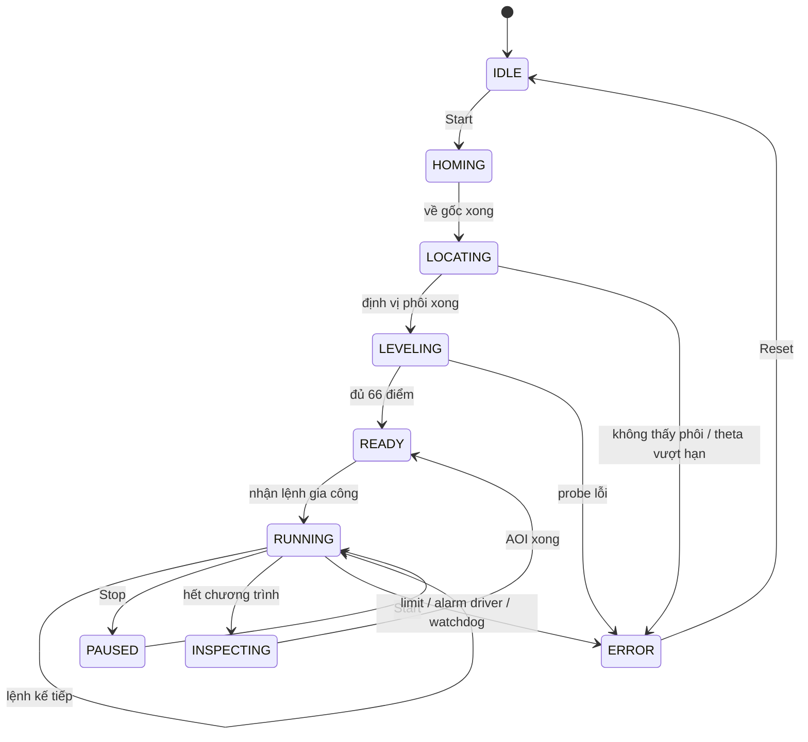

# Kiến trúc hệ thống — Máy gia công mạch PCB tự động (bản PLC S7-1200)

> Tài liệu tổng quan kiến trúc. Chi tiết từng tầng nằm ở các tài liệu chuyên đề được dẫn link.
> Xem `thiet-bi-va-chuc-nang.md` cho danh sách đầy đủ thiết bị và `luu-do-giai-thuat.md` cho lưu đồ.

---

## 1. Tổng quan một trang

```
┌─────────────────────────────────────────────────────────────────────────────┐
│                           MÁY GIA CÔNG PCB TỰ ĐỘNG                         │
│                                                                             │
│  ┌──────────────┐    USB    ┌──────────────────────────────────────────┐   │
│  │  PC (Người   │──────────▶│           Raspberry Pi 4 (Master)        │   │
│  │   dùng)      │  Gerber   │  • Chuyển Gerber/Excellon → G-code .nc   │   │
│  │  App xuất NC │  + Excl.  │  • Phân tích G-code, bù z, tối ưu lộ trình│  │
│  └──────────────┘           │  • Giao diện LCD cảm ứng 3.5"            │   │
│                             │  • Module AOI (OpenCV + YOLO)             │   │
│                             │  • python-snap7 → ISO-TCP:102             │   │
│                             └────────────┬─────────────────────────────┘   │
│                                          │ Gigabit Ethernet                 │
│                                          ▼                                  │
│                             ┌──────────────────────────────────────────┐   │
│                             │         S7-1200 CPU 1214C (Slave)        │   │
│                             │  • PTO1–3: xung bước X/Y/Z (100 kHz)    │   │
│                             │  • PWM4: tốc độ spindle                  │   │
│                             │  • MC_MoveAbsolute / MC_Home / MC_Halt   │   │
│                             │  • FB_Sequence: máy trạng thái           │   │
│                             │  • FB_Comm: ring buffer lệnh             │   │
│                             └──┬──────────────────────────────────┬───┘   │
│                 SM 1223        │                                    │        │
│                 DI8/DQ8        │                                    │        │
│            ┌───────────────────┘                                    │        │
│            ▼                                                         ▼        │
│  ┌──────────────────────┐                              ┌───────────────────┐ │
│  │  Driver + Động cơ   │                              │  Cảm biến / I/O  │ │
│  │  3× DM542 + NEMA17  │                              │  Probe leveling   │ │
│  │  BTS7960 + RS775    │                              │  Home switch ×3   │ │
│  │  6 ổ dao ATC        │                              │  Hard limit ×3    │ │
│  └──────────────────────┘                              │  E-stop (cứng)   │ │
│                                                         └───────────────────┘ │
│                                                                             │
│  ┌──────────────────────────────────────────────────────────────────────┐  │
│  │  Nguồn: 24 V/15 A (động lực)  +  PM1207 24 V/2,5 A (PLC, tách biệt) │  │
│  └──────────────────────────────────────────────────────────────────────┘  │
└─────────────────────────────────────────────────────────────────────────────┘
```

---

## 2. Quyết định kiến trúc nền tảng: Master / Slave tách biệt hoàn toàn

Ranh giới trách nhiệm giữa Pi 4 và PLC là **quyết định quan trọng nhất** của toàn bộ thiết kế.

| Pi 4 — Master | S7-1200 — Slave |
|---|---|
| Xử lý file (Gerber → `.nc`) | Thực thi chuyển động (PTO/PWM) |
| Phân tích G-code, tuyến tính hóa cung tròn | I/O, an toàn, E-stop |
| Tính leveling map, bù z sẵn vào lệnh | ATC (thay dao) |
| Tối ưu lộ trình, chia nhỏ đoạn dài | Dò probe leveling (ngắt phần cứng) |
| Toàn bộ AOI: ghép ảnh, phân đoạn, YOLO | Chỉ di chuyển tới vị trí chụp |
| Giao diện, lưu trữ | — |

**Nguyên tắc:** PLC chỉ nhận lệnh **đã sẵn sàng chạy** (tọa độ tuyệt đối, z đã bù, tốc độ đã tính).
PLC không biết và không cần biết định dạng file đầu vào là gì.

> Chi tiết: [`chuc-nang-plc.md`](chuc-nang-plc.md) §1

---

## 3. Kiến trúc phần mềm

### 3.1 Tầng PC — sinh G-code

```
Gerber (đường đồng + viền)  ─┐
Excellon (tọa độ lỗ khoan)  ─┴─▶  pcb2gcode  ──▶  file .nc (G-code chuẩn)
```

App Python + Tkinter, kiến trúc **Framework_ADL** (giữ từ đồ án gốc).
Thay hoàn toàn pipeline xử lý ảnh/PDF bằng `pcb2gcode` — định dạng vector, không sai số lượng tử hóa.

> Chi tiết: [`gerber-sang-nc.md`](gerber-sang-nc.md)

### 3.2 Tầng Pi 4 — tiền xử lý và điều phối

```
file .nc
   │
   ├─ Phân tích cú pháp G-code
   ├─ Tuyến tính hóa G02/G03 (PLC không nội suy cung tròn)
   ├─ Tra leveling map → bù z từng điểm
   ├─ Chia đoạn dài (> 5 mm) để z bám bề mặt
   ├─ Gom nhóm theo dao, sắp thứ tự nearest-neighbour
   └─ Áp phép biến đổi (xoay theta + tịnh tiến) theo vị trí phôi
          │
          ▼
   DB_Buffer (ring buffer 32 ô, word trong PLC DB)
          │  snap7 / ISO-TCP:102
          ▼
      S7-1200
```

**Bắt tay truyền dữ liệu:** cặp đếm `int_sys` / `int_cnc` — Pi nạp, tăng `int_sys`; PLC xác nhận bằng `int_cnc`. Quá hạn thì gửi lại khối cũ. Tốc độ không phải ưu tiên, độ tin cậy mới là.

> Chi tiết: [`luu-do-giai-thuat.md`](luu-do-giai-thuat.md) §7, [`chuc-nang-plc.md`](chuc-nang-plc.md) §5–§7

### 3.3 Tầng PLC — kiến trúc 3 tầng FB

Ánh xạ trực tiếp từ kiến trúc Framework_ADL / Firmware_ADL của đồ án gốc:

| Tầng đồ án gốc | TIA Portal (bản mới) | Chức năng |
|---|---|---|
| **Unit** | `FB_Axis` ×3 · `FB_Spindle` · `FB_Probe` · `FB_ToolMagazine` · `FB_IO` | Giao tiếp phần cứng cấp thấp |
| **Int** | `FB_LinearMove` · `FB_ToolChange` · `FB_Leveling` · `FB_Homing` | Chuỗi hành động phức hợp |
| **Main** | `OB1` + `FB_Sequence` + `FB_Comm` | Máy trạng thái, vòng lặp chính, nhận lệnh |

> Chi tiết: [`chuc-nang-plc.md`](chuc-nang-plc.md) §3–§4

### 3.4 Module AOI — kiến trúc lai

```
Sau gia công xong
   │
   ├─ PLC di chuyển tới 16 vị trí tile (theo lưới bao phủ vùng gia công)
   │
   └─ Pi 4 tại mỗi tile:
        ├─ Chụp IMX219 (8,1 MP, ống kính M12 8 mm, khoảng cách 123 mm)
        ├─ Khử méo ống kính
        ├─ Phân đoạn HSV → mặt nạ đồng
        ├─ XOR với mặt nạ tham chiếu Gerber (đã đăng ký tọa độ máy)
        ├─ Lọc vùng nhỏ hơn A_min
        └─ Giải phóng ảnh tile (bắt buộc — 16 tile = 0,39 GB dữ liệu thô)
   │
   └─ Sau 16 tile: YOLO phân loại CHỈ trên vùng ứng viên → 8 lớp khuyết tật D1–D8
        └─ NMS, quy đổi tọa độ về mm → bản đồ khuyết tật hiển thị trên LCD
```

> Chi tiết: [`kiem-tra-quang-hoc.md`](kiem-tra-quang-hoc.md)

---

## 4. Máy trạng thái hệ thống



---

## 5. Giao tiếp giữa các tầng

| Kết nối | Giao thức | Ghi chú |
|---|---|---|
| PC → Pi 4 | USB mass storage | File Gerber + Excellon |
| Pi 4 → PLC | **Ethernet, ISO-TCP cổng 102** (python-snap7) | Gigabit onboard Pi 4; cần bật PUT/GET và bỏ Optimized block access |
| PLC → Driver bước | **PTO phần cứng** `Q0.0`–`Q0.5` (tới 100 kHz) | Điện trở hạn dòng 2 kΩ bắt buộc ở 24 V |
| PLC → Spindle | PWM `Q0.6` → opto → BTS7960 | Relay đảo chiều `Q1.0` cho ATC |
| Probe → PLC | `I0.3` **ngắt phần cứng** (cạnh lên) | Bắt buộc — quét OB1 gây sai số Z cỡ mm |
| Pi 4 → Camera | CSI | IMX219 bản ngàm M12, ống kính rời |

---

## 6. Kiến trúc nguồn — tách biệt động lực và điều khiển

```
220 VAC
  │
  ├─▶ Nguồn 24 V / 15 A ──▶ Driver DM542 ×3, BTS7960 (spindle)
  │
  ├─▶ PM1207 24 V / 2,5 A ──▶ CPU S7-1200, SM 1223, cảm biến, relay
  │                            (tách khỏi nhiễu động lực)
  │
  └─▶ Bộ chuyển 24 V → 5 V / 5 A ──▶ Raspberry Pi 4 (qua USB-C), LCD 3.5"
```

> Tách nguồn là thực hành chuẩn công nghiệp: nhiễu từ driver bước và spindle nếu chung nguồn với PLC
> gây reset CPU hoặc đọc sai ngõ vào.

---

## 7. Các điểm thay đổi so với đồ án gốc

| Thành phần | Đồ án gốc (STM32) | Bản này (PLC) | Lý do |
|---|---|---|---|
| Bộ điều khiển | STM32F103C8T6 | **S7-1200 1214C DC/DC/DC** | 4 kênh PTO phần cứng, 100 kHz |
| Máy tính nhúng | Pi Zero 2W (512 MB, WiFi only) | **Pi 4 (4 GB, Gigabit Ethernet)** | Kết nối tất định + đủ RAM cho AOI |
| Driver bước | DRV8825 (5 V logic) | **DM542** (nhận 24 V trực tiếp) | Tương thích 24 V, biên tần số cao hơn |
| Định dạng đầu vào | PDF + xử lý ảnh | **Gerber + Excellon** | Vector, không sai số lượng tử hóa |
| Định dạng G-code | Acode tự định nghĩa | **G-code chuẩn `.nc`** | Mô phỏng được bằng phần mềm có sẵn |
| Nội suy quỹ đạo | Bresenham + BLU_mapping | **Vận tốc tỉ lệ 2 trục** | PTO độc lập, không nội suy nội bộ |
| Camera | Pi Camera 2 (ống kính liền) | **IMX219 + ống kính M12 rời** | Lấy nét được ở khoảng cách cần thiết |
| Kiểm tra chất lượng | Thủ công | **AOI tự động (OpenCV + YOLO)** | Phát hiện 8 lớp khuyết tật |
| An toàn | Không có E-stop độc lập | **E-stop đấu cứng cắt 24 V động lực** | Không đi qua PLC |

> Phân tích chi tiết đánh đổi: [`so-sanh-stm32-vs-s7.md`](so-sanh-stm32-vs-s7.md)

---

## 8. Ràng buộc cứng — không được vi phạm

| Ràng buộc | Hậu quả nếu vi phạm |
|---|---|
| CPU phải là bản **DC/DC/DC** | Bản DC/DC/Rly không phát xung PTO/PWM |
| PWM4 (`Q0.6`) **bắt buộc onboard** | SM 1223 không phát xung được |
| Điện trở **2 kΩ / 0,25 W** nối tiếp mỗi đường PUL/DIR/ENA ở 24 V | Cháy opto driver ngay khi cấp điện |
| Probe leveling dùng **ngắt phần cứng** `I0.3` | Sai số Z = cả chu kỳ quét OB1 → hỏng mạch |
| E-stop **đấu cứng cắt nguồn 24 V động lực** | Dừng khẩn phụ thuộc vào PLC — không an toàn |
| TIA Portal: bật **PUT/GET** và bỏ **Optimized block access** trên DB | snap7 kết nối thành công nhưng đọc ra toàn số 0 |
| Camera phải là IMX219 bản **ngàm M12** | Pi Camera Module 2 không lấy nét được |
| Pi 4 cấp **5 V / 3 A** đủ dòng | Under-voltage throttling, hỏng thẻ SD |
| **Thứ tự Set home: Z → X → Y** | Dao còn trong phôi khi bàn máy chạy → gãy dao |

---

## 9. Tài liệu liên quan

| File | Nội dung |
|---|---|
| [`thiet-bi-va-chuc-nang.md`](thiet-bi-va-chuc-nang.md) | Danh sách đầy đủ thiết bị, thông số, phân bổ I/O, cân bằng công suất |
| [`chuc-nang-plc.md`](chuc-nang-plc.md) | Đặc tả PLC: I/O, khối hàm FB, DB, bắt tay truyền dữ liệu, đấu dây |
| [`luu-do-giai-thuat.md`](luu-do-giai-thuat.md) | Tập hợp lưu đồ toàn hệ thống (10 lưu đồ Mermaid) |
| [`gerber-sang-nc.md`](gerber-sang-nc.md) | Pipeline sinh đường chạy dao từ file Gerber |
| [`kiem-tra-quang-hoc.md`](kiem-tra-quang-hoc.md) | AOI: chụp ghép, phân đoạn, YOLO, 8 lớp khuyết tật |
| [`dinh-vi-va-toi-uu-phoi.md`](dinh-vi-va-toi-uu-phoi.md) | Định vị phôi bằng camera, tối ưu tận dụng phôi thừa |
| [`so-sanh-stm32-vs-s7.md`](so-sanh-stm32-vs-s7.md) | Đánh đổi đầy đủ: STM32 ↔ PLC, cái mất và cái được |
