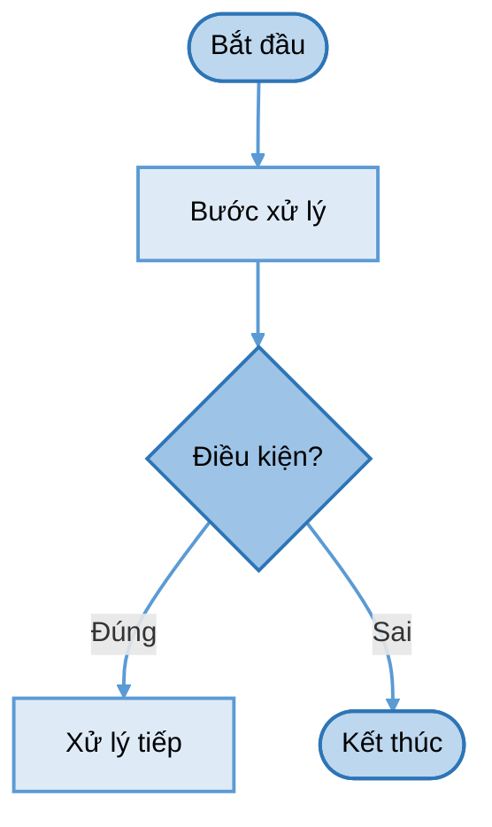

# Danh mục lưu đồ và sơ đồ

Tổng hợp toàn bộ lưu đồ và sơ đồ trong dự án, phân nhóm theo tài liệu nguồn.

Nguồn là các khối ` ```mermaid ``` ` trong tài liệu `.md`. Không sửa trực tiếp file ảnh —
sửa nguồn rồi xuất lại bằng lệnh trong [`images/README.md`](images/README.md).

---

## Tổng quan

| # | Tên lưu đồ | Loại | Tài liệu nguồn | Hình ảnh |
|---|---|---|---|---|
| 1 | Vận hành tổng thể | flowchart | [luu-do-giai-thuat.md §1](luu-do-giai-thuat.md#1-vận-hành-tổng-thể) | [PNG](images/luudo-01-1-van-hanh-tong-the.png) · [SVG](images/luudo-01-1-van-hanh-tong-the.svg) |
| 2 | Biên dịch Gerber → chương trình chạy máy | flowchart | [luu-do-giai-thuat.md §2](luu-do-giai-thuat.md#2-biên-dịch-gerber--chương-trình-chạy-máy) | [PNG](images/luudo-02-2-bien-dich-gerber-chuong-trinh-chay-may.png) · [SVG](images/luudo-02-2-bien-dich-gerber-chuong-trinh-chay-may.svg) |
| 3 | Set home | flowchart | [luu-do-giai-thuat.md §3](luu-do-giai-thuat.md#3-set-home) | [PNG](images/luudo-03-3-set-home.png) · [SVG](images/luudo-03-3-set-home.svg) |
| 4 | Leveling map 66 điểm | flowchart | [luu-do-giai-thuat.md §4](luu-do-giai-thuat.md#4-leveling-map-66-điểm) | [PNG](images/luudo-04-4-leveling-map-66-diem.png) · [SVG](images/luudo-04-4-leveling-map-66-diem.svg) |
| 5 | Nội suy đường thẳng 2 trục | flowchart | [luu-do-giai-thuat.md §5](luu-do-giai-thuat.md#5-nội-suy-đường-thẳng-2-trục) | [PNG](images/luudo-05-5-noi-suy-duong-thang-2-truc.png) · [SVG](images/luudo-05-5-noi-suy-duong-thang-2-truc.svg) |
| 6 | Thay dao tự động | flowchart | [luu-do-giai-thuat.md §6](luu-do-giai-thuat.md#6-thay-dao-tự-động) | [PNG](images/luudo-06-6-thay-dao-tu-dong.png) · [SVG](images/luudo-06-6-thay-dao-tu-dong.svg) |
| 7 | Bắt tay truyền dữ liệu | flowchart | [luu-do-giai-thuat.md §7](luu-do-giai-thuat.md#7-bắt-tay-truyền-dữ-liệu) | [PNG](images/luudo-07-7-bat-tay-truyen-du-lieu.png) · [SVG](images/luudo-07-7-bat-tay-truyen-du-lieu.svg) |
| 8 | Kiểm tra quang học sau gia công | flowchart | [luu-do-giai-thuat.md §8](luu-do-giai-thuat.md#8-kiểm-tra-quang-học-sau-gia-công) | [PNG](images/luudo-08-8-kiem-tra-quang-hoc-sau-gia-cong.png) · [SVG](images/luudo-08-8-kiem-tra-quang-hoc-sau-gia-cong.svg) |
| 9 | Định vị phôi và tối ưu vị trí đặt | flowchart | [luu-do-giai-thuat.md §9](luu-do-giai-thuat.md#9-định-vị-phôi-và-tối-ưu-vị-trí-đặt) | [PNG](images/luudo-09-9-dinh-vi-phoi-va-toi-uu-vi-tri-dat.png) · [SVG](images/luudo-09-9-dinh-vi-phoi-va-toi-uu-vi-tri-dat.svg) |
| 10 | Máy trạng thái hệ thống | stateDiagram-v2 | [luu-do-giai-thuat.md §10](luu-do-giai-thuat.md#10-máy-trạng-thái-hệ-thống) | [PNG](images/luudo-10-10-may-trang-thai-he-thong.png) · [SVG](images/luudo-10-10-may-trang-thai-he-thong.svg) |
| 11 | Luồng tổng thể Gerber → NC | flowchart | [gerber-sang-nc.md §3](gerber-sang-nc.md) | [PNG](images/gerber-01-3-luu-do-tong-the.png) · [SVG](images/gerber-01-3-luu-do-tong-the.svg) |
| 12 | Luồng tổng thể AOI | flowchart | [kiem-tra-quang-hoc.md §4.3](kiem-tra-quang-hoc.md) | [PNG](images/aoi-01-4-3-luu-do-tong-the.png) · [SVG](images/aoi-01-4-3-luu-do-tong-the.svg) |
| 13 | Định vị và tối ưu phôi | flowchart | [dinh-vi-va-toi-uu-phoi.md §10](dinh-vi-va-toi-uu-phoi.md) | [PNG](images/phoi-01-10-luu-do.png) · [SVG](images/phoi-01-10-luu-do.svg) |
| 14 | Sơ đồ khối toàn hệ thống PLC | flowchart | [chuc-nang-plc.md §8.1](chuc-nang-plc.md) | [PNG](images/plc-01-8-1-so-do-khoi-toan-he-thong.png) · [SVG](images/plc-01-8-1-so-do-khoi-toan-he-thong.svg) |

---

## Nhóm theo tài liệu nguồn

### luu-do-giai-thuat.md — Lưu đồ giải thuật toàn hệ thống

Tài liệu trung tâm, chứa 10 lưu đồ bao quát toàn bộ quy trình vận hành.

| # | Tên | Hình ảnh |
|---|---|---|
| §1 | Vận hành tổng thể | [PNG](images/luudo-01-1-van-hanh-tong-the.png) · [SVG](images/luudo-01-1-van-hanh-tong-the.svg) |
| §2 | Biên dịch Gerber → chương trình chạy máy | [PNG](images/luudo-02-2-bien-dich-gerber-chuong-trinh-chay-may.png) · [SVG](images/luudo-02-2-bien-dich-gerber-chuong-trinh-chay-may.svg) |
| §3 | Set home | [PNG](images/luudo-03-3-set-home.png) · [SVG](images/luudo-03-3-set-home.svg) |
| §4 | Leveling map 66 điểm | [PNG](images/luudo-04-4-leveling-map-66-diem.png) · [SVG](images/luudo-04-4-leveling-map-66-diem.svg) |
| §5 | Nội suy đường thẳng 2 trục | [PNG](images/luudo-05-5-noi-suy-duong-thang-2-truc.png) · [SVG](images/luudo-05-5-noi-suy-duong-thang-2-truc.svg) |
| §6 | Thay dao tự động | [PNG](images/luudo-06-6-thay-dao-tu-dong.png) · [SVG](images/luudo-06-6-thay-dao-tu-dong.svg) |
| §7 | Bắt tay truyền dữ liệu | [PNG](images/luudo-07-7-bat-tay-truyen-du-lieu.png) · [SVG](images/luudo-07-7-bat-tay-truyen-du-lieu.svg) |
| §8 | Kiểm tra quang học sau gia công | [PNG](images/luudo-08-8-kiem-tra-quang-hoc-sau-gia-cong.png) · [SVG](images/luudo-08-8-kiem-tra-quang-hoc-sau-gia-cong.svg) |
| §9 | Định vị phôi và tối ưu vị trí đặt | [PNG](images/luudo-09-9-dinh-vi-phoi-va-toi-uu-vi-tri-dat.png) · [SVG](images/luudo-09-9-dinh-vi-phoi-va-toi-uu-vi-tri-dat.svg) |
| §10 | Máy trạng thái hệ thống | [PNG](images/luudo-10-10-may-trang-thai-he-thong.png) · [SVG](images/luudo-10-10-may-trang-thai-he-thong.svg) |

### gerber-sang-nc.md — Sinh đường chạy dao: Gerber → file .nc

| # | Tên | Hình ảnh |
|---|---|---|
| §3 | Luồng tổng thể | [PNG](images/gerber-01-3-luu-do-tong-the.png) · [SVG](images/gerber-01-3-luu-do-tong-the.svg) |

### kiem-tra-quang-hoc.md — Kiểm tra quang học tự động (AOI)

| # | Tên | Hình ảnh |
|---|---|---|
| §4.3 | Lưu đồ tổng thể AOI | [PNG](images/aoi-01-4-3-luu-do-tong-the.png) · [SVG](images/aoi-01-4-3-luu-do-tong-the.svg) |

### dinh-vi-va-toi-uu-phoi.md — Định vị phôi và tối ưu vị trí đặt

| # | Tên | Hình ảnh |
|---|---|---|
| §10 | Lưu đồ định vị và tối ưu | [PNG](images/phoi-01-10-luu-do.png) · [SVG](images/phoi-01-10-luu-do.svg) |

### chuc-nang-plc.md — Đặc tả PLC

| # | Tên | Hình ảnh |
|---|---|---|
| §8.1 | Sơ đồ khối toàn hệ thống | [PNG](images/plc-01-8-1-so-do-khoi-toan-he-thong.png) · [SVG](images/plc-01-8-1-so-do-khoi-toan-he-thong.svg) |

---

## Quy ước ký hiệu

Tất cả `flowchart` trong dự án dùng chung bộ ký hiệu và màu sắc sau:

| Ký hiệu Mermaid | Hình dạng | Ý nghĩa | Màu fill |
|---|---|---|---|
| `([...])` | Bo tròn | Bắt đầu / Kết thúc | `#BDD7EE` |
| `[/.../]` | Bình hành | Nhập / Xuất dữ liệu | `#DEEBF7` |
| `[...]` | Chữ nhật | Xử lý | `#DEEBF7` |
| `{...}` | Thoi | Quyết định — hai nhánh **Đúng** / **Sai** | `#9DC3E6` |
| `(( ))` | Tròn nhỏ | Điểm nối các nhánh | `#9DC3E6` |

Màu đường liên kết: `#5B9BD5`, độ dày 2 px.

`stateDiagram-v2` (lưu đồ §10) dùng `classDef proc fill:#DEEBF7,stroke:#5B9BD5` —
**không** dùng `linkStyle` vì cú pháp đó không hợp lệ trong `stateDiagram-v2`.

---

## Cú pháp mẫu

Khung tối thiểu để thêm lưu đồ mới nhất quán với phong cách hiện tại:



---

## Xem thêm

| File | Nội dung |
|---|---|
| [`images/README.md`](images/README.md) | Hướng dẫn xuất ảnh PNG/SVG từ Mermaid, danh sách kích thước file |
| [`luu-do-giai-thuat.md`](luu-do-giai-thuat.md) | Nguồn Mermaid cho 10 lưu đồ chính + ghi chú thiết kế |
| [`gerber-sang-nc.md`](gerber-sang-nc.md) | Đặc tả pipeline Gerber → NC kèm lưu đồ |
| [`kiem-tra-quang-hoc.md`](kiem-tra-quang-hoc.md) | Đặc tả AOI kèm lưu đồ |
| [`dinh-vi-va-toi-uu-phoi.md`](dinh-vi-va-toi-uu-phoi.md) | Đặc tả định vị phôi kèm lưu đồ |
| [`chuc-nang-plc.md`](chuc-nang-plc.md) | Đặc tả PLC kèm sơ đồ khối |
