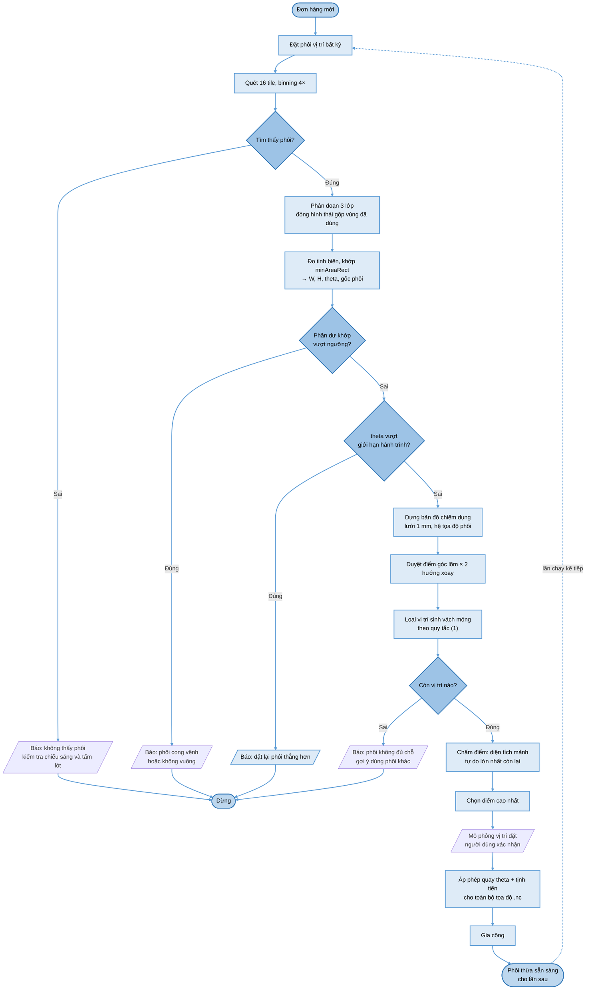

# Định vị phôi và tối ưu tận dụng phôi thừa

Tài liệu này lấp một khoảng trống trong thiết kế: hệ thống có **leveling map cho cao độ Z** nhưng
chưa có gì xác định **vị trí phôi trên mặt phẳng XY**. Thiếu khâu này thì mọi tọa độ trong file
`.nc` đều treo lơ lửng — máy không biết phay ở đâu.

Đồng thời giải bài toán người dùng đặt ra: **tận dụng phôi thừa qua nhiều lần gia công**.

---

## 1. Đặt vấn đề

Phôi được đặt tay lên bàn máy, không có đồ gá định vị. Cần xác định:

| Đại lượng | Ý nghĩa |
|---|---|
| `(x0, y0)` | Gốc tọa độ phôi trong hệ tọa độ máy |
| `θ` | Góc xoay của phôi so với trục máy |
| `W`, `H` | Kích thước thực của phôi |
| Bản đồ chiếm dụng | Vùng nào còn đồng dùng được, vùng nào đã khoét |

Ràng buộc thực tế người dùng nêu rõ: **phôi không hẳn là hình chữ nhật**. Phôi đã qua gia công
thường có một hoặc nhiều **lỗ khoét**, biên ngoài có thể **sứt mẻ** do cắt tay.

## 2. So sánh ba phương án định vị

| Phương án | Ưu | Nhược |
|---|---|---|
| Đồ gá cơ khí (chốt định vị) | Đơn giản, không cần phần mềm | Mất linh hoạt; phôi thừa hình dạng bất kỳ **không kẹp được** |
| Dò cạnh bằng probe | Không cần camera | **Dao phay PCB ⌀0,1–0,3 mm gãy khi chịu lực ngang** — không dùng được |
| **Dò bằng camera** | Không tiếp xúc, xử lý được mọi hình dạng | Cần hiệu chuẩn, phụ thuộc điều kiện sáng |

Chọn **camera**. Phương án probe bị loại vì lý do vật lý, không phải vì bất tiện: mũi dao phay cách
ly có đường kính nhỏ hơn 0,3 mm, chạm ngang vào cạnh phôi là gãy.

## 3. Quyết định kiến trúc: quét ảnh, không dùng cơ sở dữ liệu

Cách thông thường để quản lý phôi thừa là **ghi sổ** — lưu vào CSDL rằng phôi số 3 đã dùng vùng nào.
Tài liệu này chọn cách khác: **quét phôi trước mỗi lần chạy** và đọc trực tiếp trạng thái thực tế.

| | Ghi sổ (CSDL phôi thừa) | **Quét ảnh mỗi lần** |
|---|---|---|
| Nguồn sự thật | Bản ghi phần mềm | **Quan sát thực tế** |
| Người dùng cắt phôi bằng tay | Sai lệch, hỏng | Vẫn đúng |
| Lẫn lộn hai phôi giống nhau | Sai lệch, hỏng | Vẫn đúng |
| Phôi đặt xoay 180° hoặc lật | Phải khớp orientation | **Không liên quan** |
| Mất dữ liệu, đổi máy | Mất hết | Không ảnh hưởng |
| Phần cứng thêm | — | **Không, đã có sẵn** |

Bước quét đã cần cho khâu định vị nên chức năng quản lý phôi thừa gần như **miễn phí**.

## 4. Thuật toán bốn bước

### 4.1 Bước 1 — Quét tìm phôi

Dùng lại mã chụp ghép của AOI nhưng bật **binning 4×**:

| | AOI | **Quét tìm phôi** |
|---|---|---|
| GSD | 13,3 µm/px | **53,2 µm/px** |
| Ảnh mỗi tile | 12,3 MP | **0,8 MP** — nhẹ hơn 16 lần |
| Sai số biên phôi | — | **±0,16 mm** (≈3 px) |

Đủ chính xác để tìm biên phôi thô, mà nhanh hơn hẳn.

```
Ghép bản đồ thô → ngưỡng Otsu → contour ngoài lớn nhất → biên dạng phôi
                             → contour trong → các lỗ đã khoét
```

### 4.2 Bước 2 — Đo tinh và dựng hệ tọa độ phôi

Chụp lại ở **độ phân giải đầy đủ** tại các cạnh, rồi:

1. **Biến đổi Hough** tìm các đoạn thẳng biên
2. Giao hai đường thẳng → tọa độ góc, độ chính xác **±6,7 µm**
3. Khớp bình phương tối thiểu → `W`, `H`, `θ`, gốc `(x0, y0)`

> **Nguyên tắc: đo cạnh rồi suy ra góc, không đo góc trực tiếp.**
> Khớp đường thẳng qua hàng nghìn điểm ảnh biên cho kết quả **dưới một điểm ảnh**, trong khi dò
> góc bằng Harris hay Shi-Tomasi trên biên răng cưa chỉ đạt ±1–2 px. Chênh nhau hơn một bậc.

**Phôi méo, không đủ 4 góc.** Đây là chỗ phôi không-chữ-nhật thực sự gây khó — không còn 4 góc để
lấy gốc. Giải bằng **`cv2.minAreaRect`** trên biên dạng ngoài: trả về tâm, kích thước và góc của
hình chữ nhật nhỏ nhất bao trọn phôi. Một góc sứt không làm dịch chuyển đáng kể hình bao này.

> **Cảnh báo:** với phôi **gần vuông**, góc do `minAreaRect` trả về có thể nhảy giữa 0° và 90° giữa
> hai lần quét. Phải chuẩn hóa — **luôn chọn cạnh dài làm trục X** — để kết quả tất định.

### 4.3 Bước 3 — Dựng bản đồ chiếm dụng

Phân đoạn HSV thành **ba lớp**, rồi rời rạc hóa thành lưới **1 mm trong hệ tọa độ phôi**:

| Lớp | Biểu hiện trên ảnh | Trạng thái ô |
|---|---|---|
| Đồng nguyên vẹn | Cam kim loại | **Trống — dùng được** |
| FR4 lộ / lỗ thủng xuyên | Vàng nâu, hoặc tối (thấy tấm lót) | **Đã dùng** |
| Ngoài biên phôi | — | **Không dùng được** |

> **Bắt buộc có bước đóng hình thái (morphological closing) với kernel lớn.**
> Vùng đã phay không phải toàn FR4 mà là **mạng rãnh xen giữa các đường đồng còn lại**. Không gộp
> thì thuật toán sẽ tưởng các mẩu đồng cũ là chỗ trống dùng được, và phay đè lên mạch cũ.

Dùng **hệ tọa độ phôi** chứ không phải tọa độ máy: nhờ vậy phép quay `θ` được tách riêng, và bài
toán xếp hình luôn ở dạng trục thẳng.

### 4.4 Bước 4 — Tìm vị trí đặt tối ưu

Trượt hình chữ nhật mạch (đã cộng lề) trên lưới, thử **2 hướng xoay**, chấm điểm mỗi vị trí hợp lệ.

**Hàm mục tiêu: tối đa hóa diện tích hình chữ nhật tự do lớn nhất còn lại.**
Tính bằng thuật toán *largest rectangle in histogram*, độ phức tạp `O(W×H)`.

Ý nghĩa: giữ phôi thừa thành **một mảnh lớn dùng được**, thay vì nhiều mảnh vụn.

## 5. Vì sao hàm mục tiêu quan trọng đến vậy

Mô phỏng chuỗi 4 đơn hàng trên phôi 100 × 75 mm, lề 3 mm mỗi bên,
chuỗi `[60×40, 35×30, 30×25, 25×20]`:

| Chiến lược | Vừa được | Diện tích dùng |
|---|---|---|
| First-fit — "vừa là lấy" | **1/4 mạch** | 32% |
| **Tối đa hóa mảnh tự do lớn nhất** | **3/4 mạch** | **56%** |

Nguyên nhân nằm trọn ở **đơn hàng đầu tiên**:

| | First-fit | Tối ưu |
|---|---|---|
| Đặt mạch 60 × 40 | không xoay → chiếm 66 × 46 | **xoay 90° → chiếm 46 × 66** |
| Dải còn lại | rộng 34 mm — **vô dụng** | rộng 54 mm — **nhét thêm 2 mạch** |

Một quyết định xoay ở bước đầu quyết định phôi dùng được 32% hay 56%.

### 5.1 Luôn phải thử cả hai hướng xoay

| Phôi | Mạch | Không xoay | Xoay 90° | Chênh |
|---|---|---|---|---|
| 100 × 75 | 60 × 40 | 2900 mm² | **4050 mm²** | **+40%** |
| 90 × 70 | 60 × 40 | 2160 mm² | **3080 mm²** | **+43%** |
| 70 × 55 | 60 × 40 | **630 mm²** | *không vừa* | — |

Hai dòng đầu: xoay tiết kiệm ~40% phôi. Dòng cuối cho thấy chiều ngược lại cũng đúng — có lúc
**chỉ một hướng là vừa**. Bắt buộc thử cả hai, không mặc định hướng nào.

### 5.2 Không đặt mạch ở giữa phôi

Cùng một mạch 60 × 40 trên phôi 100 × 75:

| Đặt ở đâu | Mảnh tự do lớn nhất còn lại | Mạch lớn nhất còn làm được |
|---|---|---|
| Giữa phôi | 100 × 15 mm | **94 × 9 mm** |
| Sát góc | 100 × 29 mm | **94 × 23 mm** |

Đặt giữa biến phôi thừa thành **cái khung** chỉ còn dải hẹp quanh viền. Hàm mục tiêu tự động tránh
điều này — không cần lập trình quy tắc riêng.

## 6. Ràng buộc cơ khí: bề dày vách

Đây là ràng buộc **thuần hình học không thấy được**. Đặt mạch mới cách lỗ cũ vài mm sẽ để lại vách
mỏng **rung và gãy khi dao chạy qua**, hỏng cả mạch mới lẫn phôi.

> **Quy tắc:** vách còn lại phải **bằng 0** (ăn liền vào lỗ cũ, không sinh vách) **hoặc ≥ `t_min`**.
> Không được rơi vào khoảng giữa.

Với dải rộng `S` và bề rộng mạch kể cả lề `B`:

$$\text{hợp lệ} \iff B = S \ \ \text{hoặc} \ \ B \le S - t_{min} \tag{1}$$

Khoảng cấm là `S − t_min < B < S`. Ví dụ `S` = 20 mm, `t_min` = 8 mm:

| `B` | Vách còn lại | |
|---|---|---|
| ≤ 12 mm | ≥ 8 mm | Được |
| **13 – 19 mm** | **1 – 7 mm** | **Cấm** |
| 20 mm | 0 mm | Được — lấp đầy dải |

Phôi hình khung còn **ít vật liệu để kẹp** hơn, và phay gần mép lỗ thì vật liệu dễ bị dao đẩy —
phải tính vào khi chọn `t_min`. Phần mềm **kiểm tra và báo trước khi chạy**, không để máy phay rồi
mới gãy.

## 7. Phôi hình dạng bất kỳ

Ví dụ đã mô phỏng: phôi có biên ngoài **sứt góc trên-phải, vát chéo góc dưới-phải**, cộng **hai lỗ
khác hình dạng** — một chữ nhật 30 × 20 và một hình chữ L.

```
   +--------------------------------------------------+
   |...................OOOOOOOOOOOOOOOO........       |  <- sut goc
   |...................OOOOOOOOOOOOOOOO........       |
   |...................OOOOOOOOOOOOOOOO........       |
   |...................OOOOOOOOOOOOOOOO...............|
   |....###############OOOOOOOOOOOOOOOO...............|
   |....###############OOOOOOOOOOOOOOOO...............|  lo chu nhat
   |....###############OOOOOOOOOOOOOOOO...............|  sat ngay mach moi
   |....###############OOOOOOOOOOOOOOOO...............|
   |....###############OOOOOOOOOOOOOOOO...............|
   |....###############OOOOOOOOOOOOOOOO...............|
   |....###############OOOOOOOOOOOOOOOO...............|
   |....###############...............................|
   |....###############...............................|
   |..................................................|
   |..........................##################......|
   |..........................##################......|
   |..........................##################......|  lo chu L
   |..........................##################......|
   |..........................##########..............|
   |..........................##########..............|
   |..........................##########............. |
   |..........................##########...........   |  <- vat cheo
   |..........................##########.........     |
   |...........................................       |
   |.........................................         |
   |.......................................           |
   +--------------------------------------------------+
     O = mach moi    # = lo da khoet    . = dong con dung duoc
                       (1 ky tu = 2 mm)
```

Duyệt được **494 vị trí hợp lệ**; vị trí thắng nằm ở `(38, 0)` — **sát mép trên và sát cạnh lỗ cũ**,
vách bằng 0 nên hai lỗ ăn liền thành một. Không cần dạy quy tắc "ép sát"; hàm mục tiêu tự dẫn tới đó
vì mọi vị trí ở giữa đều làm vỡ vùng trống thành mảnh vụn.

### 7.1 Vì sao chọn lưới chiếm dụng thay vì MaxRects

| Tình huống | Biểu diễn đa giác / MaxRects | **Lưới chiếm dụng** |
|---|---|---|
| Lỗ giữa phôi | Đa giác có lỗ, xử lý riêng | Ô đã chiếm |
| Nhiều lỗ | Phức tạp hẳn | Ô đã chiếm |
| Lỗ không phải chữ nhật | Phải xấp xỉ đa giác | Ô đã chiếm |
| Biên ngoài sứt mẻ | Phải dò lại biên dạng | Ô ngoài phôi |
| Phôi cắt tay méo mó | Rất khó | Ô ngoài phôi |

Lưới chỉ trả lời một câu cho mỗi ô: **dùng được hay không**. Nó không cần biết ô đó bị chiếm vì lý
do gì. MaxRects nhanh hơn nhưng **chỉ làm việc với hình chữ nhật**; phôi thật thì không.

### 7.2 Tối ưu tốc độ duyệt

| Cách duyệt | Số vị trí | Thời gian | Kết quả |
|---|---|---|---|
| Mọi ô lưới | 1600 | 3,06 s | điểm 4050 |
| **Chỉ điểm góc** | **12** | **0,023 s** | điểm 4050 |

**Nhanh hơn 136 lần, kết quả y hệt.** Vị trí tối ưu luôn nằm ở chỗ mạch tiếp xúc với biên hoặc với
vùng đã chiếm ở ít nhất hai phía, nên chỉ cần duyệt các điểm đó.

> Với phôi méo, điểm góc phải lấy từ **góc lõm của bản đồ chiếm dụng**, không phải góc của hình bao.

## 8. Ràng buộc góc xoay phôi

Phôi đặt nghiêng thì hộp bao của nó lớn hơn chính nó, và máy phải với tới toàn bộ hộp bao đó.
Với phôi 180 × 130 mm trên máy có hành trình 220 × 235 mm:

| θ | Hộp bao | |
|---|---|---|
| 0° | 180,0 × 130,0 | OK |
| 10° | 199,8 × 159,3 | OK |
| 20° | 213,6 × 183,7 | OK |
| 25° | 218,1 × 193,9 | OK, sát giới hạn |
| **30°** | **220,9 × 202,6** | **Vượt hành trình X** |

Với phôi cỡ lớn, **xoay quá ~25° là máy không với tới**. Phần mềm phải kiểm tra và báo
*"đặt lại phôi thẳng hơn"* **trước khi chạy**.

## 9. Ngân sách sai số

| Nguồn sai số | Giá trị |
|---|---|
| Khớp đường thẳng qua hàng nghìn điểm ảnh | ±6,7 µm |
| **Offset camera – trục chính** | **±20,0 µm** |
| Méo ống kính còn dư sau hiệu chuẩn | ±5,0 µm |
| Định vị máy | ±2,5 µm |
| **Tổng (căn bậc hai tổng bình phương)** | **±21,8 µm** |

Bằng khoảng **11%** bề rộng đường mạch nhỏ nhất (0,2 mm) — chấp nhận được.

Sai số góc xoay, đo trên hai góc cách nhau 180 mm: **±3,0 mdeg** nếu chỉ tính sai số khớp đường
thẳng, **±9,8 mdeg** nếu tính cả ngân sách.

> **Khâu chiếm 20 trên 21,8 µm là offset camera – trục chính**, nên đây là chỗ đáng đầu tư hiệu
> chuẩn nhất. Quy trình: phay dấu chữ thập tại tọa độ đã biết → chụp → đo độ lệch tâm ảnh →
> lặp ở 5–9 vị trí khác nhau rồi lấy trung bình.
>
> Phép hiệu chuẩn này **dùng chung** cho cả định vị phôi lẫn đăng ký ảnh AOI — làm một lần, dùng
> hai chỗ.

## 10. Lưu đồ



Điểm đáng chú ý: **không có bước nào cập nhật sổ sách**. Phôi thừa tự mang thông tin về trạng thái
của mình, lần chạy sau chỉ việc quét lại.

## 11. Điều kiện và phương án dự phòng

**Cần tấm lót hy sinh màu tối** dưới phôi để ngưỡng Otsu tách được đồng khỏi nền, và để nhìn thấy
lỗ thủng xuyên. Tấm này vốn đã cần cho công đoạn cắt viền.

**Phương án dự phòng khi điều kiện quang học kém:** dò cạnh bằng **que dò cùn** (không phải dao
phay) qua mạch `I0.3`, chấp nhận chậm hơn và chỉ xác định được hình chữ nhật bao.

## 12. Khi nào cần thuật toán phức tạp hơn

| Bài toán | Độ phức tạp | Cách giải |
|---|---|---|
| 1 mạch trên phôi nguyên | 8 phương án | Duyệt vét cạn — tối ưu tuyệt đối |
| 1 mạch trên phôi đã khoét lỗ | vài trăm vị trí | Duyệt điểm góc — vẫn vét cạn được |
| **Nhiều mạch xếp đồng thời** | **NP-khó** | Mới cần MaxRects / Bottom-Left-Fill |

**Không dùng heuristic (di truyền, luyện kim) cho hai nhóm đầu** — đó là làm phức tạp hóa một bài
toán đã giải xong bằng cách duyệt hết.

**Giới hạn của cách tiếp cận hiện tại:** đơn hàng đến lần lượt, không biết trước, nên chỉ tối ưu
được từng bước (tham lam) với hàm mục tiêu hướng tới tương lai. Nếu biết trước cả hàng đợi thì xếp
đồng thời sẽ tốt hơn — nhưng đó là tình huống hiếm với máy phục vụ học tập.

---

## Tài liệu liên quan

| File | Nội dung |
|---|---|
| [`thiet-bi-va-chuc-nang.md`](thiet-bi-va-chuc-nang.md) | Danh sách thiết bị và chức năng tổng thể |
| [`chuc-nang-plc.md`](chuc-nang-plc.md) | Đặc tả PLC: I/O, khối hàm, sơ đồ nguyên lý |
| [`gerber-sang-nc.md`](gerber-sang-nc.md) | Sinh đường chạy dao từ file Gerber |
| [`kiem-tra-quang-hoc.md`](kiem-tra-quang-hoc.md) | Kiểm tra quang học tự động sau gia công |
| [`luu-do-giai-thuat.md`](luu-do-giai-thuat.md) | Tập hợp lưu đồ giải thuật toàn hệ thống |
