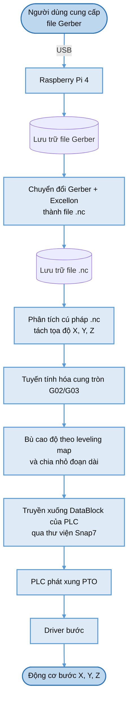

# Sinh đường chạy dao: Gerber → file .nc

Đặc tả khâu chuyển đổi dữ liệu thiết kế thành chương trình gia công.
Tài liệu này **thay thế** phương pháp xử lý ảnh từ file PDF của đồ án gốc.

---

## 1. Vì sao chuyển từ PDF sang Gerber

### 1.1 Bối cảnh trong đồ án gốc

Đồ án gốc đã thử đọc dữ liệu từ **DXF + NC Drill** nhưng từ bỏ, với lý do được ghi rõ:

> *"nếu xử lí theo cách này thì sai số sẽ rất lớn, việc liên kết dữ liệu của đường mạch và lỗ khoan
> giữa hai file là rất khó vì chúng là các định dạng file khác nhau và thuật toán di chuyển cũng
> rất phức tạp"*

Nhóm tác giả chuyển sang **PDF + xử lý ảnh** vì PDF là định dạng phổ biến, phần mềm nào cũng xuất được.

### 1.2 Vì sao Gerber giải đúng vấn đề đó

Nhận định của đồ án gốc là chính xác **với DXF**, nhưng Gerber không mắc nhược điểm ấy:

| Vấn đề của đồ án gốc | Gerber giải quyết thế nào |
|---|---|
| "Liên kết dữ liệu giữa hai file rất khó vì khác định dạng" | Gerber (RS-274X) và Excellon **thuộc cùng một bộ tiêu chuẩn xuất bản**, dùng **chung một hệ tọa độ và cùng một gốc** theo định nghĩa của định dạng |
| "Sai số rất lớn" | Gerber là **định dạng vector chính xác tuyệt đối**, không qua rasterize nên không có sai số lượng tử hóa điểm ảnh |
| Phải suy đoán đâu là lỗ khoan, đâu là chip dán | Excellon **khai báo tường minh** đường kính và tọa độ từng lỗ |
| Phải dò biên dạng bằng Canny rồi rút gọn | Biên dạng **đã là đa giác và cung tròn** trong file |

### 1.3 Những gì trở nên không cần thiết

Chuyển sang Gerber **loại bỏ hoàn toàn** các khâu sau khỏi pipeline sinh đường chạy dao:

| Khâu bị loại | Lý do |
|---|---|
| Rasterize PDF ở 600 DPI | Gerber đã là vector |
| Ngưỡng hóa Otsu, khử nhiễu hình thái | Không có ảnh để xử lý |
| Lọc Canny, `findContours` | Biên dạng có sẵn |
| Offset bán kính dao bằng `pyclipper` | Công cụ chuyển đổi làm sẵn |
| Rút gọn Douglas–Peucker | Không sinh ra hàng nghìn điểm để phải rút gọn |
| Suy đoán tâm và bán kính lỗ khoan từ bounding box | Excellon khai báo tường minh |
| **Kiểm tra đồng bộ 3 file PDF** | Các layer dùng chung gốc tọa độ theo chuẩn |
| **Lật trục Y** | Gerber dùng hệ tọa độ Descartes chuẩn, gốc dưới-trái, cùng chiều với máy |

> **Bốn rủi ro nghiêm trọng nhất của phương pháp PDF đều biến mất:** lệch 3 file, chặn trên epsilon
> của phép rút gọn, quên lật trục Y, và sai số lượng tử hóa điểm ảnh. Đây là lý do kỹ thuật chính
> để chuyển đổi, không chỉ là chuyện tiện lợi.

> **Đánh đổi duy nhất:** người dùng phải xuất Gerber thay vì PDF. Đây không phải rào cản thực tế —
> mọi phần mềm thiết kế mạch (Altium, KiCad, Proteus, EasyEDA) đều xuất Gerber, vì đó là định dạng
> bắt buộc để đặt gia công mạch công nghiệp.

---

## 2. Dữ liệu đầu vào

| File | Chuẩn | Nội dung |
|---|---|---|
| `*.gbr` lớp đồng | RS-274X (Extended Gerber) | Đường mạch, pad, vùng đồng |
| `*.gko` / `*.gm1` đường viền | RS-274X | Biên dạng ngoài của bo |
| `*.drl` / `*.txt` | Excellon | Tọa độ và đường kính lỗ khoan |

Người dùng nạp qua **USB** vào Raspberry Pi 4, đúng như lưu đồ.

---

## 3. Lưu đồ tổng thể

---

## 4. Bước 1 — Chuyển đổi Gerber thành .nc

### 4.1 Công cụ

| Công cụ | Ngôn ngữ | Ghi chú |
|---|---|---|
| **pcb2gcode** | C++ (CLI) | Chuyên cho phay cách ly, gọi được từ Python bằng `subprocess`. **Khuyến nghị** |
| **FlatCAM** | Python | Có GUI, nhiều tính năng, nhưng nặng hơn |
| **gerbonara** / `pcb-tools` | Python | Thư viện phân tích Gerber, dùng khi cần tự viết logic |

Đề xuất **pcb2gcode**: nhẹ, chạy tốt trên Pi 4, và bản thân nó đã thực hiện offset bán kính dao —
đúng công việc mà `pyclipper` phải làm trong phương án PDF.

### 4.2 Tham số cần truyền

| Tham số | Ý nghĩa |
|---|---|
| Đường kính dao phay | Quyết định lượng offset biên dạng |
| Số lần phay cách ly | 1 lần cho khe hở rộng, nhiều lần để mở rộng khe |
| Chiều sâu cắt (Z) | Ăn hết lớp đồng, không ăn sâu vào FR4 |
| Chiều cao nâng dao | An toàn khi di chuyển nhanh |
| Tốc độ tiến dao | Theo thông số máy: cắt 8,33 mm/s, di chuyển 20 mm/s |
| Bảng dao | Ánh xạ đường kính lỗ Excellon sang 6 ổ dao trên máy |

### 4.3 Ràng buộc phải kiểm tra trước khi chạy

> **Đường kính dao phải nhỏ hơn khe hở nhỏ nhất trên bo.** Nếu không, không thể phay cách ly được
> và pcb2gcode sẽ sinh đường chạy sai hoặc bỏ qua vùng đó. Phần mềm phải **kiểm tra và cảnh báo
> trước khi máy chạy**, chứ không để phay hỏng bo rồi mới biết.

---

## 5. Bước 2 — Phân tích .nc và tách tọa độ

File `.nc` là G-code. Các lệnh cần xử lý:

| Lệnh G-code | Ý nghĩa | Ánh xạ sang PLC |
|---|---|---|
| `G00 X.. Y.. Z..` | Di chuyển nhanh, dao nâng | `cmd_id = rapid` |
| `G01 X.. Y.. F..` | Cắt theo đường thẳng | `cmd_id = line` |
| `G02` / `G03` | Cung tròn thuận / ngược chiều | **Phải tuyến tính hóa** — xem §6 |
| `M03` / `M05` | Bật / tắt trục chính | `FB_Spindle` |
| `M06 T..` | Thay dao | `cmd_id = toolchange` |
| `G04` | Dừng chờ | Xử lý trên Pi |

Sau khi phân tích, mỗi dòng lệnh trở thành một bản ghi `(cmd_id, x, y, z, feed, tool)` với tọa độ
quy đổi về **µm kiểu `DInt`** để ghi vào Data Block.

Thư viện gợi ý: `pygcode`, hoặc tự viết bộ phân tích — cú pháp G-code do pcb2gcode sinh ra khá hạn
chế nên bộ phân tích tự viết chỉ vài trăm dòng.

---

## 6. Bước 3 — Tuyến tính hóa cung tròn

> **Ràng buộc cứng:** PLC S7-1200 điều khiển các trục PTO **độc lập**, chỉ dựng được đường thẳng
> bằng phương pháp vận tốc tỉ lệ (xem `chuc-nang-plc.md` §4.2). **Không có nội suy cung tròn.**

Hai cách xử lý, chọn một:

| Cách | Thực hiện | Đánh giá |
|---|---|---|
| **(a)** Cấu hình pcb2gcode chỉ xuất lệnh tuyến tính | Đặt tùy chọn tắt xuất cung tròn | **Đơn giản hơn, khuyến nghị** |
| **(b)** Tự tuyến tính hóa `G02`/`G03` trên Pi | Chia cung thành các dây cung | Kiểm soát được sai số |

Nếu chọn (b), sai số dây cung (chord error) $e$ với cung bán kính $R$ chia thành các đoạn góc
$\Delta\theta$:

$$e = R\left(1 - \cos\frac{\Delta\theta}{2}\right) \tag{1}$$

Chọn $\Delta\theta$ sao cho $e$ nhỏ hơn độ phân giải trục (2,5 µm) thì sai số tuyến tính hóa không
quan sát được trên sản phẩm.

---

## 7. Bước 4 — Bù cao độ và chia nhỏ đoạn

Hai xử lý này **giữ nguyên** từ thiết kế trước, vì chúng không liên quan tới định dạng đầu vào.

### 7.1 Bù cao độ theo leveling map

Sau khi chạy leveling map 66 điểm (ma trận 6×11), mỗi tọa độ `(x, y)` được tra ra giá trị `z` thực
tế của bề mặt phíp đồng, cộng vào chiều sâu cắt danh định.

### 7.2 Chia nhỏ đoạn dài

> **Mọi đoạn dài hơn ~5 mm phải được chia nhỏ.** Một đoạn thẳng dài chỉ có `z` ở hai đầu sẽ phay hụt
> ở giữa hoặc cắt đứt mạch — đúng vấn đề mà leveling map sinh ra để giải quyết. Bỏ qua bước này thì
> 66 điểm đo trở nên vô nghĩa.

Cả hai bước chạy **trên Raspberry Pi lúc biên dịch**, không phải trong PLC — xem `chuc-nang-plc.md` §1.

---

## 8. Bước 5 — Truyền xuống PLC

Chi tiết ở `chuc-nang-plc.md` §5 và §7.1. Tóm tắt:

- Thư viện **`python-snap7`**, giao thức S7 trên ISO-TCP **cổng 102**
- Ghi vào **`DB_Buffer`** dạng ring buffer 32 đoạn, không gửi từng lệnh một
- Bắt tay bằng cặp đếm `int_sys` / `int_cnc` — giữ nguyên triết lý *"truyền không nhanh, nhưng phải đủ"*
  của đồ án gốc

> **Vì sao phải dùng ring buffer.** Mỗi lượt đọc/ghi snap7 mất 5–20 ms → trần chỉ 50–200 lệnh/s.
> Với chương trình vài nghìn dòng G-code, bắt tay từng lệnh sẽ khiến thời gian truyền vượt cả thời
> gian gia công.

---

## 9. Tối ưu bổ sung

Hai tối ưu không có trong đồ án gốc, nên bổ sung ở khâu hậu xử lý trên Pi:

| Tối ưu | Cách làm | Lợi ích |
|---|---|---|
| **Gom nhóm theo mũi khoan** | Sắp xếp các lỗ theo đường kính, khoan hết cùng cỡ rồi mới thay dao | Giảm số lần ATC — mỗi lần thay dao tốn vài giây |
| **Sắp thứ tự đường chạy** | Nearest-neighbour trên điểm đầu mỗi đường | Giảm quãng di chuyển không cắt |

pcb2gcode đã sắp xếp một phần, nhưng chưa tối ưu cho ràng buộc 6 ổ dao cụ thể của máy này.

---

## 10. So sánh hai phương án

| Hạng mục | PDF + xử lý ảnh (đồ án gốc) | **Gerber → .nc (bản mới)** |
|---|---|---|
| Định dạng đầu vào | 3 file PDF tỉ lệ 1:1 | Gerber + Excellon |
| Bản chất dữ liệu | Raster (điểm ảnh) | **Vector (chính xác tuyệt đối)** |
| Sai số lượng tử hóa | 42,3 µm ở 600 DPI | **Không có** |
| Đồng bộ giữa các file | **Rủi ro cao** — phải tự căn chỉnh | **Bảo đảm bởi chuẩn định dạng** |
| Nhận diện lỗ khoan | Suy đoán từ bounding box | **Khai báo tường minh trong Excellon** |
| Offset bán kính dao | Tự làm bằng `pyclipper` | Công cụ chuyển đổi làm sẵn |
| Thư viện cần | PyMuPDF, OpenCV, NumPy, pyclipper, Pillow | **pcb2gcode + bộ phân tích G-code** |
| Thời gian xử lý | 10–60 s (ảnh 13 MP) | **Vài giây** |
| Định dạng trung gian | Acode tự định nghĩa | **G-code chuẩn** — kiểm tra được bằng phần mềm mô phỏng có sẵn |

> **Một lợi ích phụ đáng kể:** file `.nc` là G-code chuẩn nên có thể mở bằng bất kỳ phần mềm mô
> phỏng CNC nào để kiểm tra đường chạy dao trước khi gia công — điều mà định dạng Acode tự định
> nghĩa không làm được.

---

## 11. Điều gì còn giữ lại từ đồ án gốc

Việc chuyển sang Gerber **không phủ nhận** phần xử lý ảnh của đồ án gốc — nó chuyển phần đó sang một
vai trò khác và có giá trị hơn:

| Kiến thức từ đồ án gốc | Nay dùng ở đâu |
|---|---|
| Phân đoạn ảnh, ngưỡng hóa, hình thái học | **Kiểm tra quang học sau gia công** (`kiem-tra-quang-hoc.md` §6.3) |
| Đổi tọa độ pixel ↔ mm qua PPI | **Tính GSD cho camera** (`kiem-tra-quang-hoc.md` §5.1) |
| Tìm biên dạng, thành phần liên thông | **Sinh vùng ứng viên khuyết tật** (`kiem-tra-quang-hoc.md` §6.4) |
| Leveling map 66 điểm | Giữ nguyên |
| Triết lý bắt tay truyền dữ liệu | Giữ nguyên |

---

## Tài liệu liên quan

| File | Nội dung |
|---|---|
| [`thiet-bi-va-chuc-nang.md`](thiet-bi-va-chuc-nang.md) | Danh sách thiết bị và chức năng tổng thể |
| [`chuc-nang-plc.md`](chuc-nang-plc.md) | Đặc tả PLC: I/O, khối hàm, Data Block, an toàn, đấu dây |
| [`luu-do-giai-thuat.md`](luu-do-giai-thuat.md) | Tập hợp lưu đồ giải thuật toàn hệ thống |
| [`dinh-vi-va-toi-uu-phoi.md`](dinh-vi-va-toi-uu-phoi.md) | Định vị phôi và tối ưu tận dụng phôi thừa |
| [`kiem-tra-quang-hoc.md`](kiem-tra-quang-hoc.md) | Kiểm tra quang học tự động sau gia công |
| [`so-sanh-stm32-vs-s7.md`](so-sanh-stm32-vs-s7.md) | Đối chiếu bản gốc ↔ bản PLC |
