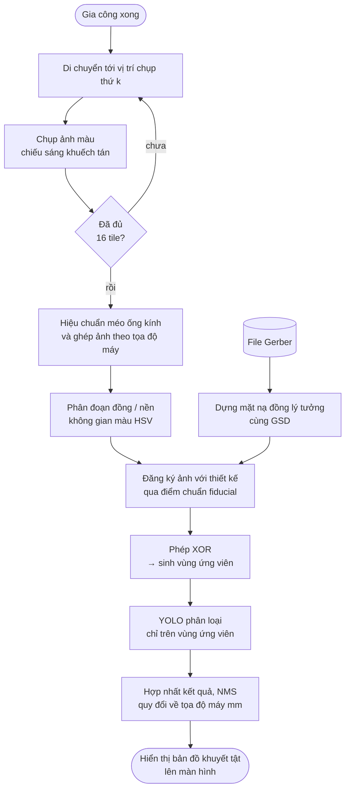

# Kiểm tra quang học tự động (AOI) mạch in sau gia công

Đặc tả phương pháp phát hiện khuyết tật trên bo mạch PCB sau khi phay, sử dụng thị giác máy tính
kết hợp mạng nơ-ron phát hiện đối tượng.

---

## 1. Đặt vấn đề

### 1.1 Bối cảnh

Máy gia công mạch PCB theo phương pháp phay cách ly (isolation milling) tạo đường mạch bằng cách
bóc lớp đồng dọc theo biên dạng, thay vì ăn mòn hóa học. Phương pháp này loại bỏ hóa chất độc hại
nhưng đưa vào các nguồn sai số cơ khí mà phương pháp ăn mòn không có: độ mòn dao, sai lệch cao độ
bề mặt phíp đồng, hiện tượng mất bước của động cơ, và rung động trong quá trình cắt.

Hệ quả là **chất lượng bo mạch không được đảm bảo bởi bản thân quá trình gia công**. Người vận hành
hiện phải kiểm tra bằng mắt thường và đồng hồ đo thông mạch — công việc tốn thời gian, phụ thuộc
kinh nghiệm, và dễ bỏ sót các khuyết tật kích thước dưới 0,2 mm.

### 1.2 Mục tiêu

Xây dựng hệ thống kiểm tra quang học tự động (Automated Optical Inspection — AOI) tích hợp trên máy,
thực hiện ngay sau khi gia công xong, đáp ứng các yêu cầu:

| # | Yêu cầu | Chỉ tiêu |
|---|---|---|
| R1 | Phát hiện khuyết tật kích thước ≥ 0,1 mm | Độ phân giải không gian ≤ 0,025 mm/px |
| R2 | Tỉ lệ bỏ sót thấp — ưu tiên hơn tỉ lệ báo nhầm | Recall ≥ 0,95 |
| R3 | Chạy được trên phần cứng nhúng sẵn có | Raspberry Pi 4, không GPU rời |
| R4 | Thời gian kiểm tra chấp nhận được | ≤ 2 phút cho bo 180 × 130 mm |
| R5 | Phân loại được **loại** khuyết tật | Không chỉ báo có/không |

> **Về thứ tự ưu tiên R2.** Trong kiểm tra chất lượng, bỏ sót (escape) tốn kém hơn báo nhầm
> (false call): bo lỗi lọt qua sẽ gây hỏng mạch điện phía sau, trong khi báo nhầm chỉ tốn công
> người kiểm tra lại. Do đó thiết kế ưu tiên **recall** hơn precision.

---

## 2. Cơ sở lý thuyết và công trình liên quan

### 2.1 Hai hướng tiếp cận trong AOI mạch in

Tài liệu về kiểm tra quang học mạch in phân thành hai hướng chính:

**(a) So sánh với mẫu tham chiếu (reference-based / golden-template comparison).**
Ảnh bo cần kiểm tra được đăng ký (registration) với một ảnh mẫu chuẩn — có thể là ảnh của bo đạt
chất lượng, hoặc ảnh dựng từ dữ liệu thiết kế. Khuyết tật là phần sai khác giữa hai ảnh, thường
tính bằng phép XOR trên ảnh nhị phân.

- *Ưu điểm:* xác định, không cần dữ liệu huấn luyện, độ nhạy rất cao — về nguyên tắc mọi sai khác
  hình học đều bị phát hiện.
- *Nhược điểm:* cực kỳ nhạy với sai số đăng ký và biến thiên chiếu sáng; sinh nhiều báo nhầm;
  **không phân loại được** khuyết tật thuộc loại nào.

**(b) Học máy trên ảnh (learning-based).**
Huấn luyện mạng nơ-ron phát hiện trực tiếp mẫu khuyết tật từ ảnh, không cần mẫu tham chiếu.
Các họ mô hình phát hiện đối tượng gồm hai nhóm: hai giai đoạn (Faster R-CNN) cho độ chính xác cao
hơn nhưng chậm, và một giai đoạn (SSD, YOLO) cho tốc độ suy luận cao hơn.

- *Ưu điểm:* phân loại được khuyết tật; bền vững hơn với biến thiên chiếu sáng và sai số đăng ký nhỏ.
- *Nhược điểm:* cần tập dữ liệu có nhãn; khó phát hiện đối tượng rất nhỏ so với kích thước ảnh;
  chi phí tính toán cao khi phải quét toàn bộ ảnh độ phân giải lớn.

### 2.2 Hạn chế của các tập dữ liệu công khai hiện có

Các tập dữ liệu khuyết tật PCB được dùng phổ biến trong tài liệu (tiêu biểu là **DeepPCB** và
**HRIPCB**) đều xây dựng cho bo mạch sản xuất theo **phương pháp ăn mòn**, với sáu lớp khuyết tật
đặc trưng của công nghệ đó: *missing hole, mouse bite, open circuit, short, spur, spurious copper*.

**Cơ chế sinh khuyết tật của phay cách ly khác về bản chất** với ăn mòn: khuyết tật do dao mòn, do
sai lệch cao độ trục Z, do mất bước động cơ — không tồn tại trong quy trình ăn mòn. Ngược lại,
khuyết tật do lỗi phim hoặc lỗi hóa chất của quy trình ăn mòn không xuất hiện ở phay.

> **Hệ quả cho đề tài:** không thể dùng trực tiếp tập dữ liệu công khai. Phải **tự xây dựng tập dữ
> liệu và tự định nghĩa bộ nhãn** phù hợp với công nghệ phay — xem §8. Đây đồng thời là một đóng góp
> có tính mới của đề tài.

> **Lưu ý khi viết báo cáo:** tên và đặc điểm hai tập dữ liệu nêu trên được dẫn theo trí nhớ tổng
> hợp. **Phải tra cứu và trích dẫn nguyên bản** (tác giả, năm, hội nghị/tạp chí, số lượng ảnh, số
> lớp) trước khi đưa vào phần Tài liệu tham khảo.

---

## 3. Phân loại khuyết tật mạch phay

Bộ nhãn đề xuất, xây dựng theo **cơ chế vật lý sinh ra khuyết tật** trong phay cách ly:

| Mã | Tên khuyết tật | Biểu hiện | Nguyên nhân cơ khí |
|---|---|---|---|
| `D1` | **Đứt mạch** (open circuit) | Đường mạch bị cắt rời | Dao ăn quá sâu, leveling map sai, mất bước |
| `D2` | **Chập mạch** (short) | Còn cầu đồng giữa hai đường lẽ ra tách rời | Dao mòn, Z quá nông, đường kính dao > khe hở |
| `D3` | **Sót đồng** (spurious copper) | Vùng đồng lẽ ra bóc hết nhưng còn sót | Đường chạy phay mặt không phủ hết |
| `D4` | **Hụt đường mạch** (undercut) | Đường mạch mảnh hơn thiết kế | Dao lệch tâm, offset bán kính dao sai |
| `D5` | **Bavia / mép nham nhở** (burr) | Mép đường mạch không sắc, có ba via đồng | Dao mòn hoặc tốc độ tiến dao không phù hợp |
| `D6` | **Lỗ khoan lệch** (misaligned hole) | Tâm lỗ lệch khỏi pad | Sai số định vị, lệch gốc tọa độ |
| `D7` | **Thiếu lỗ khoan** (missing hole) | Không có lỗ tại vị trí thiết kế | Gãy mũi khoan, lỗi thay dao |
| `D8` | **Hỏng pad** (pad damage) | Dao lẹm vào pad | Offset sai, rung động |

Trong tám lớp trên, **`D1` và `D2` là nghiêm trọng nhất** vì làm bo mất chức năng hoàn toàn.
`D3`–`D5` ảnh hưởng chất lượng nhưng bo vẫn có thể dùng được. Phân cấp này nên được phản ánh trong
hàm mất mát khi huấn luyện và trong ngưỡng cảnh báo khi vận hành.

---

## 4. Kiến trúc hệ thống đề xuất

### 4.1 Lập luận thiết kế

Hai hướng ở §2.1 có ưu nhược bù trừ nhau. Nhưng với hệ thống này còn một yếu tố quyết định:

> **Máy đã tự tạo ra bo mạch, nên nó biết chính xác bo phải trông như thế nào.**
> Dữ liệu Gerber đầu vào chính là mẫu tham chiếu lý tưởng, và tọa độ máy tại thời điểm chụp cho
> phép đăng ký ảnh với thiết kế gần như miễn phí.

Đây là lợi thế mà một hệ AOI độc lập (kiểm tra bo do máy khác sản xuất) không có.

Ngoài ra, phân tích chi phí tính toán ở §6.3 cho thấy **quét vét toàn ảnh bằng YOLO là bất khả thi
trên Raspberry Pi 4** (ước tính 3–4 phút, vi phạm R4).

Từ hai lập luận trên, đề xuất **kiến trúc lai hai giai đoạn**:

```
Giai đoạn 1 — Sinh vùng ứng viên (reference-based)
    So sánh ảnh phân đoạn với mặt nạ đồng lý tưởng dựng từ Gerber
    → tập vùng nghi ngờ, độ bỏ sót gần bằng 0

Giai đoạn 2 — Phân loại & lọc (learning-based)
    YOLO chạy CHỈ trên các vùng ứng viên
    → loại báo nhầm do sai số đăng ký/chiếu sáng, và gán nhãn loại khuyết tật
```

### 4.2 Vì sao kiến trúc lai là lựa chọn đúng

Kiến trúc này giải quyết **đồng thời ba vấn đề**, mỗi vấn đề vốn đủ để loại một trong hai hướng đơn lẻ:

| Vấn đề | Hướng đơn lẻ thất bại thế nào | Kiến trúc lai giải quyết |
|---|---|---|
| **Độ bỏ sót (R2)** | YOLO đơn lẻ có thể bỏ sót khuyết tật hiếm gặp, chưa có trong tập huấn luyện | Giai đoạn 1 xác định, bắt mọi sai khác hình học |
| **Báo nhầm** | So sánh tham chiếu đơn lẻ sinh rất nhiều báo nhầm | Giai đoạn 2 học cách phân biệt khuyết tật thật với nhiễu đăng ký |
| **Chi phí tính toán (R3, R4)** | YOLO quét vét toàn ảnh mất 3–4 phút | Giai đoạn 2 chỉ chạy trên ~50 vùng → 10–15 s |

Nói cách khác: giai đoạn 1 cho **độ nhạy**, giai đoạn 2 cho **độ đặc hiệu và khả năng phân loại**,
và sự kết hợp cho **tính khả thi tính toán**.

### 4.3 Lưu đồ tổng thể



---

## 5. Thu nhận ảnh

### 5.1 Phân tích độ phân giải không gian

Ký hiệu GSD (Ground Sampling Distance) là kích thước thực tế mà một điểm ảnh biểu diễn.

Theo quy tắc thực nghiệm trong thị giác máy, cần tối thiểu **3–5 điểm ảnh phủ chiều nhỏ nhất của
đặc trưng** để phát hiện tin cậy. Với yêu cầu R1 (khuyết tật nhỏ nhất `d` = 0,1 mm):

$$\text{GSD} \le \frac{d}{n_{px}} = \frac{0{,}1}{4} = 0{,}025 \text{ mm/px} \tag{1}$$

Số điểm ảnh cần theo chiều rộng bo:

$$W_{px} = \frac{180}{0{,}025} = 7200 \text{ px} \tag{2}$$

**So sánh các cảm biến khả dụng.** Bảng dưới đây có một cột mà phân tích thị giác máy hay bỏ sót,
nhưng ở bài toán này lại là **tiêu chí quyết định**: khoảng cách lấy nét tối thiểu.

| Cảm biến | Điểm ảnh | Ống kính | **Lấy nét gần nhất** | GSD tốt nhất đạt được | Khuyết tật 0,1 mm |
|---|---|---|---|---|---|
| Pi Camera Module 3 (IMX708) | 4608 × 2592 | **Gắn liền** | ~100 mm | 28,2 µm/px | 3,55 px ✗ |
| Pi AI Camera (IMX500) | 4056 × 3040 | **Gắn liền** | ~100 mm | ~30 µm/px | ~3,3 px ✗ |
| ESP32-CAM (OV2640) | 1600 × 1200 | Gắn liền | ~100 mm | 112 µm/px | 0,89 px ✗ |
| **Pi HQ Camera (IMX477)** | **4056 × 3040** | **Rời, ngàm C/CS** | **Tùy ống kính** | **13,3 µm/px** | **7,5 px ✓** |

**Chỉ HQ Camera đạt yêu cầu R1**, và lý do là **ống kính rời**, không phải số điểm ảnh — IMX500 có
cùng số điểm ảnh nhưng vẫn trượt. Phân tích đầy đủ ở §5.4.

Cấu hình chốt: **HQ Camera + ống kính C-mount 12 mm**, FOV 54 × 40,5 mm.

| Phương án | GSD | Số px phủ khuyết tật 0,1 mm | Kết luận |
|---|---|---|---|
| Chụp **một ảnh** phủ cả bo | 180/4056 = **0,0444 mm/px** | 2,25 px | **Không đạt R1** |
| Chụp **ghép** (mosaic), FOV rộng 54 mm | 54/4056 = **0,0133 mm/px** | 7,5 px | **Đạt R1** |

### 5.2 Phương pháp chụp ghép sử dụng chính chuyển động của máy

Đây là điểm khai thác đặc thù của hệ thống: **máy CNC vốn đã có cơ cấu định vị hai trục với độ phân
giải 2,5 µm**. Thay vì dùng ống kính telecentric độ phân giải cao (đắt), ta gắn camera lên cụm trục
chính và **dùng chính chuyển động của máy để quét ảnh theo lưới**.

Với FOV 54 × 40,5 mm và độ chồng lấn 15%:

$$n_{cols} = \left\lceil \frac{180}{54 \times 0{,}85} \right\rceil = 4, \qquad
n_{rows} = \left\lceil \frac{130}{40{,}5 \times 0{,}85} \right\rceil = 4 \tag{3}$$

→ **16 tile**, tổng 197 MP, dữ liệu thô ~0,59 GB.

| Chỉ tiêu | Giá trị |
|---|---|
| Thời gian chụp | 16 × (di chuyển 1,5 s + ổn định 0,5 s + chụp 0,3 s) ≈ **37 s** |
| Bộ nhớ | **Xử lý tuần tự từng tile**, không giữ toàn bộ 0,59 GB trong RAM |

> **Lợi ích kép của phương pháp này:** ngoài độ phân giải, tọa độ máy tại mỗi lần chụp **chính là
> thông tin đăng ký ảnh**. Sai số định vị của máy (2,5 µm) nhỏ hơn GSD (13,3 µm) một bậc, nên phép
> ghép ảnh gần như không sinh sai số — điều mà ghép ảnh bằng đặc trưng (feature matching) thông
> thường không đạt được.

> **Ràng buộc bộ nhớ.** Giữ cả 16 tile trong RAM là 0,59 GB dữ liệu thô, chưa kể bản trung gian.
> Bắt buộc xử lý **streaming từng tile**: chụp → phân đoạn → so sánh → lưu vùng ứng viên → giải
> phóng. Đây là lý do Raspberry Pi 4 (4 GB) khả thi còn Pi Zero 2W (512 MB) thì không.

> **Tỉ lệ khung hình ảnh hưởng tới số tile.** IMX477 tỉ lệ 4:3 nên phủ 40,5 mm chiều dọc, trong khi
> một cảm biến 16:9 cùng độ phân giải ngang chỉ phủ ~30 mm — mất thêm một hàng tile. Đây là lý do
> 16 tile thay vì 20 dù GSD gần như nhau.

### 5.3 Chiếu sáng

Lưu đồ đã nêu đúng yêu cầu *"phải đảm bảo sáng đều"*. Cụ thể hóa:

Bề mặt đồng có **phản xạ gương mạnh** (specular). Chiếu sáng trực tiếp sẽ tạo điểm chói bão hòa,
làm hỏng bước phân đoạn ở §7. Yêu cầu:

| Hạng mục | Đề xuất | Lý do |
|---|---|---|
| Kiểu đèn | **Đèn vòng LED khuếch tán** hoặc đèn vòm (dome) | Triệt phản xạ gương trên đồng |
| Nhiệt độ màu | Cố định, chỉ số hoàn màu CRI cao | Giữ ổn định sắc độ đồng giữa các lần chụp |
| Vị trí | Gắn đồng trục với camera, di chuyển cùng | Điều kiện chiếu sáng **giống hệt nhau ở mọi tile** |
| Che sáng ngoài | Che kín khoang chụp | Loại nhiễu do ánh sáng phòng thay đổi |

> **Chiếu sáng đồng nhất giữa các tile quan trọng hơn cường độ tuyệt đối.** Nếu tile 1 và tile 2 có
> độ sáng khác nhau, ngưỡng phân đoạn sẽ khác nhau, sinh sai khác giả ở đường ghép — biểu hiện thành
> một dải khuyết tật ảo chạy dọc biên tile.

### 5.4 Ràng buộc quang học và lựa chọn ống kính

Phân tích ở §5.1 mới chỉ trả lời *cần bao nhiêu điểm ảnh*. Nhưng độ phân giải không gian không do
cảm biến quyết định một mình — nó là **tích hợp của cảm biến và ống kính**. Bỏ qua vế ống kính là
sai lầm thường gặp, và ở bài toán này nó loại thẳng phần lớn các phương án.

#### 5.4.1 Khoảng cách lấy nét tối thiểu — ràng buộc bị bỏ sót

Với ống kính **gắn liền**, trường nhìn tỉ lệ thuận với khoảng cách làm việc:

$$\text{FOV} = 2\,d\,\tan\frac{\theta}{2} \tag{4}$$

trong đó $d$ là khoảng cách tới vật, $\theta$ là góc nhìn ngang. Muốn FOV nhỏ (để GSD nhỏ) thì phải
đưa camera lại **thật gần**. Nhưng ống kính gắn liền có giới hạn lấy nét gần nhất.

Với Camera Module 3 ($\theta \approx 66°$, lấy nét gần nhất ~100 mm):

| Khoảng cách | FOV rộng | GSD | Khuyết tật 0,1 mm |
|---|---|---|---|
| **100 mm** — gần nhất lấy nét được | 130 mm | 28,2 µm/px | **3,55 px** ✗ |
| 150 mm | 195 mm | 42,3 µm/px | 2,37 px ✗ |
| 200 mm | 260 mm | 56,4 µm/px | 1,77 px ✗ |

Để đạt FOV 54 mm cần đặt camera cách bo:

$$d = \frac{54}{2\tan(33°)} = 42 \text{ mm} \tag{5}$$

**Gần hơn khả năng lấy nét.** Ống kính không tháo được nên không có cách khắc phục —
Camera Module 3 và AI Camera (IMX500) đều bị loại vì lý do này, bất kể số điểm ảnh.

#### 5.4.2 Chọn tiêu cự cho ống kính rời

Ngàm C/CS của HQ Camera cho phép chọn tiêu cự theo khoảng cách lắp đặt thực tế. Độ phóng đại:

$$m = \frac{w_{sensor}}{\text{FOV}} = \frac{6{,}287}{54} = 0{,}116 \tag{6}$$

Khoảng cách làm việc theo công thức thấu kính mỏng:

$$d = f\,\frac{1+m}{m} \approx 9{,}59\,f \tag{7}$$

| Tiêu cự | Khoảng cách camera–bo | Đánh giá |
|---|---|---|
| 8 mm | 77 mm | Khi khoảng hở hẹp |
| **12 mm** | **115 mm** | **Chọn** |
| 16 mm | 153 mm | Khi khoảng hở rộng |
| 25 mm | 240 mm | Vượt chiều cao máy 300 mm — loại |

> **Phải đo trước khi mua ống kính:** khoảng hở từ dầm ngang xuống mặt bàn máy. Công thức (7) là
> gần đúng thấu kính mỏng; ống kính thực có vị trí mặt phẳng chính khác đôi chút, nên **cần chừa
> dung sai và ưu tiên ống kính có vòng chỉnh nét đủ hành trình**.

#### 5.4.3 Chiều sâu trường ảnh và khẩu độ

Bề mặt phíp đồng không phẳng tuyệt đối — chính lý do tồn tại của leveling map (§B2). Nếu chiều sâu
trường ảnh nhỏ hơn độ cong vênh, một phần bo sẽ mất nét và bước phân đoạn hỏng ở đúng vùng đó.

$$\text{DOF} \approx \frac{2Nc\,(1+m)}{m^2} \tag{8}$$

với $N$ là trị số khẩu độ, $c$ là đường kính vòng tròn mờ cho phép (lấy ~2 điểm ảnh = 3,1 µm).

| Khẩu độ | DOF |
|---|---|
| f/2.8 | 1,43 mm |
| f/5.6 | 2,86 mm |
| **f/8** | **4,09 mm** |
| f/11 | 5,62 mm |

Chọn **f/8**: 4,09 mm thừa sức bao dung sai cong vênh, mà chưa tới ngưỡng nhiễu xạ đáng kể.

#### 5.4.4 Lấy nét tay và khẩu độ tay là *yêu cầu*, không phải thiệt thòi

Đây là điểm dễ bị hiểu ngược, nên nêu rõ:

| Đặc điểm | Vì sao là ưu điểm ở bài toán này |
|---|---|
| **Lấy nét tay, cố định** | Lấy nét tự động sẽ **dò nét lại giữa các tile**. Mỗi lần đổi nét làm độ phóng đại thay đổi nhẹ (*focus breathing*) → **phá vỡ giả định GSD không đổi** mà phép ghép ảnh và đăng ký với mặt nạ Gerber (§6.2) dựa hoàn toàn vào. Khóa nét một lần là điều kiện cần |
| **Khẩu độ chỉnh tay** | Cho phép chọn f/8 để có DOF 4 mm. Camera Module 3 cố định f/1.8 → DOF chỉ ~1,4 mm, không đủ biên cho bo cong vênh |

Nói cách khác, hai "tính năng" của camera tiêu dùng — lấy nét tự động và khẩu độ lớn cố định — đều
**phản tác dụng** trong đo lường thị giác máy.

---

## 6. Hiệu chuẩn, đăng ký và phân đoạn

### 6.1 Hiệu chuẩn camera

Hiệu chuẩn nội (intrinsic calibration) bằng bàn cờ, dùng `cv2.calibrateCamera`, để ước lượng ma trận
nội $K$ và hệ số méo $(k_1, k_2, p_1, p_2, k_3)$, sau đó khử méo bằng `cv2.undistort`.

Méo ống kính hình thùng ở biên ảnh có thể lên tới vài điểm ảnh — cùng bậc với kích thước khuyết tật
cần phát hiện, nên **không thể bỏ qua**.

Hiệu chuẩn tỉ lệ (mm/px) xác định bằng cách cho máy di chuyển một đoạn đã biết và đo dịch chuyển
tương ứng trên ảnh — phương pháp này chính xác hơn dùng thông số danh định của ống kính.

### 6.2 Đăng ký ảnh với thiết kế

Mặt nạ đồng lý tưởng $M_{ref}$ được dựng (render) trực tiếp từ file Gerber ở **cùng GSD** với ảnh chụp.

Phép biến đổi giữa hệ tọa độ ảnh và hệ tọa độ thiết kế là **biến đổi affine** (hoặc homography nếu
mặt phẳng camera không song song tuyệt đối với bàn máy):

$$\begin{bmatrix} x' \\ y' \\ 1 \end{bmatrix} =
H \begin{bmatrix} x \\ y \\ 1 \end{bmatrix} \tag{9}$$

Ước lượng $H$ bằng **điểm chuẩn (fiducial)**: phay 3 dấu chuẩn tại tọa độ đã biết ở góc bo trong
cùng chương trình gia công. Vì chúng do chính máy tạo ra, sai số vị trí của chúng bằng sai số máy.

> **Sai số đăng ký là nguồn báo nhầm chính của giai đoạn 1.** Nếu $H$ lệch 3 px thì mọi biên đường
> mạch đều sinh sai khác giả rộng 3 px. Đây chính là lý do phải có giai đoạn 2 để lọc.

### 6.3 Phân đoạn đồng / nền

Lưu đồ mô tả *"chuyển thành ảnh trắng đen, đen là phần đồng, trắng là phần mạch bị phay"*.
Cụ thể hóa về mặt phương pháp:

Ngưỡng hóa trên ảnh xám **không đủ tin cậy** vì độ sáng của đồng thay đổi theo góc chiếu và mức độ
oxy hóa. Đề xuất phân đoạn trong **không gian màu HSV**, khai thác đặc trưng sắc độ (hue) của đồng
tương phản rõ với nền FR4:

$$M(x,y) = \begin{cases}
1 & \text{nếu } H_{min} \le H(x,y) \le H_{max} \ \wedge\ S(x,y) \ge S_{min} \\
0 & \text{ngược lại}
\end{cases} \tag{10}$$

Sau đó khử nhiễu bằng phép mở/đóng hình thái (morphological opening/closing).

Các ngưỡng $H_{min}, H_{max}, S_{min}$ xác định bằng thực nghiệm trên tập ảnh mẫu và **phải hiệu
chỉnh lại nếu đổi loại phíp đồng hoặc đổi đèn**.

### 6.4 Sinh vùng ứng viên

$$D = M_{obs} \oplus M_{ref} \tag{11}$$

trong đó $\oplus$ là phép XOR theo từng điểm ảnh, $M_{obs}$ là mặt nạ đồng quan sát được,
$M_{ref}$ là mặt nạ lý tưởng.

Sau khi lọc bỏ các thành phần liên thông có diện tích nhỏ hơn ngưỡng $A_{min}$ (nhiễu đăng ký),
mỗi thành phần liên thông còn lại sinh một hộp bao — **vùng ứng viên** đưa sang giai đoạn 2.

Ngưỡng $A_{min}$ điều khiển đánh đổi giữa số lượng ứng viên và độ bỏ sót. Đặt quá cao sẽ bỏ sót
khuyết tật nhỏ (vi phạm R2); đặt quá thấp sẽ sinh hàng nghìn ứng viên (vi phạm R4).
**Đây là siêu tham số cần khảo sát bằng thực nghiệm.**

---

## 7. Mô hình phát hiện

### 7.1 Lựa chọn kiến trúc

| Tiêu chí | Faster R-CNN (2 giai đoạn) | **YOLO (1 giai đoạn)** |
|---|---|---|
| Độ chính xác | Cao hơn | Thấp hơn chút |
| Tốc độ suy luận | Chậm | **Nhanh** |
| Phù hợp thiết bị biên không GPU | Kém | **Tốt** |

Chọn **YOLO** do ràng buộc R3 (Raspberry Pi 4, không GPU rời). Trong họ YOLO, chọn biến thể
**nano** (YOLOv8n hoặc YOLOv5n) — số tham số nhỏ nhất, phù hợp thiết bị biên.

### 7.2 Triển khai trên Raspberry Pi 4

| Hạng mục | Đề xuất |
|---|---|
| Huấn luyện | Trên PC có GPU hoặc Google Colab — **không huấn luyện trên Pi** |
| Định dạng triển khai | Xuất sang **ONNX** hoặc **NCNN**, lượng tử hóa **INT8** |
| Kích thước đầu vào | 640 × 640 (vùng ứng viên được cắt và co giãn về kích thước này) |
| Thời gian suy luận ước tính | **0,2 – 0,5 s/vùng** trên Pi 4 CPU — `[cần đo thực tế]` |

**Ngân sách tính toán** (giả định 50 vùng ứng viên trên một bo):

| Phương án | Số lần suy luận | Thời gian | Kết luận |
|---|---|---|---|
| Quét vét toàn ảnh (sliding window) | 800 | **3 – 4 phút** | Vi phạm R4 |
| **Chỉ chạy trên vùng ứng viên** | ~50 | **10 – 15 s** | **Đạt R4** |

Cộng thời gian chụp 37 s và xử lý ảnh, tổng chu kỳ kiểm tra ước tính **~72 s**, đạt R4.

> **Phương án tăng tốc nếu cần:** gắn thêm **Google Coral USB Accelerator** (Edge TPU) đưa thời gian
> suy luận xuống cỡ hàng chục mili-giây, khi đó quét vét toàn ảnh cũng trở nên khả thi. Đổi lại là
> chi phí phần cứng và ràng buộc mô hình phải lượng tử hóa hoàn toàn về INT8.

---

## 8. Xây dựng tập dữ liệu

Như đã phân tích ở §2.2, không có tập dữ liệu công khai phù hợp. Phải tự xây dựng.

### 8.1 Sinh khuyết tật có kiểm soát

Đây là ưu thế đặc biệt của việc tích hợp AOI **trên chính máy gia công**: có thể **cố ý tạo ra
khuyết tật đã biết trước loại và vị trí** bằng cách nhiễu loạn tham số gia công.

| Lớp | Cách sinh có kiểm soát |
|---|---|
| `D1` Đứt mạch | Đặt Z sâu hơn thiết kế 0,05–0,15 mm tại vị trí định trước |
| `D2` Chập mạch | Đặt Z nông hơn, hoặc dùng dao đường kính lớn hơn khe hở |
| `D3` Sót đồng | Bỏ bớt một số đường trong chương trình phay mặt |
| `D4` Hụt đường mạch | Thay đổi giá trị offset bán kính dao |
| `D5` Bavia | Dùng dao đã mòn, hoặc tăng tốc độ tiến dao |
| `D6` Lỗ khoan lệch | Cộng offset vào tọa độ khoan |
| `D7` Thiếu lỗ khoan | Bỏ lệnh khoan tại vị trí định trước |
| `D8` Hỏng pad | Đặt offset âm gần pad |

**Ý nghĩa phương pháp luận:** vì khuyết tật được sinh chủ động tại tọa độ đã biết, **nhãn ground
truth có sẵn mà không cần gán nhãn thủ công** cho vị trí — chỉ cần xác nhận lại bằng mắt. Điều này
giảm mạnh công sức xây dựng tập dữ liệu và loại bỏ sai lệch chủ quan của người gán nhãn.

### 8.2 Tổ chức tập dữ liệu

| Hạng mục | Đề xuất |
|---|---|
| Chia tập | Train / Val / Test theo tỉ lệ 70 / 15 / 15, **chia theo bo mạch, không chia theo ảnh** |
| Tăng cường dữ liệu | Xoay 90°, lật, thay đổi độ sáng/tương phản nhẹ |
| **Không** dùng | Biến dạng phối cảnh mạnh, cắt xén làm mất hình dạng khuyết tật |
| Mất cân bằng lớp | Bo đạt chất lượng chiếm đa số → dùng oversampling hoặc focal loss |

> **Chia theo bo, không chia theo ảnh.** Nếu các tile của cùng một bo bị phân tán vào cả tập huấn
> luyện lẫn tập kiểm tra thì kết quả đánh giá bị thổi phồng do rò rỉ dữ liệu (data leakage) —
> mô hình đã "nhìn thấy" chính bo đó lúc huấn luyện.

---

## 9. Phương pháp đánh giá

### 9.1 Độ đo mức phát hiện

Với TP, FP, FN lần lượt là số phát hiện đúng, báo nhầm, bỏ sót:

$$P = \frac{TP}{TP+FP}, \qquad R = \frac{TP}{TP+FN}, \qquad F_1 = \frac{2PR}{P+R} \tag{12}$$

Một phát hiện được tính là đúng khi độ trùng khớp với hộp bao thực đạt ngưỡng:

$$\text{IoU} = \frac{|B_{pred} \cap B_{gt}|}{|B_{pred} \cup B_{gt}|} \ge 0{,}5 \tag{13}$$

Độ chính xác trung bình theo lớp và trung bình toàn cục:

$$AP_c = \int_0^1 P_c(R)\,dR, \qquad
\text{mAP} = \frac{1}{|C|}\sum_{c \in C} AP_c \tag{14}$$

Báo cáo cả **mAP@0.5** và **mAP@0.5:0.95**, kèm **AP riêng cho từng lớp** `D1`–`D8` và **ma trận
nhầm lẫn**.

### 9.2 Độ đo mức vận hành

Ngoài các độ đo học thuật, cần báo cáo hai chỉ số mà ngành kiểm tra chất lượng dùng trực tiếp:

$$\text{Escape rate} = \frac{FN}{TP+FN} = 1 - R \tag{15}$$

$$\text{False call rate} = \frac{FP}{\text{số bo được kiểm tra}} \tag{16}$$

Escape rate phản ánh trực tiếp yêu cầu R2. False call rate phản ánh công sức người vận hành phải
bỏ ra để kiểm tra lại — nếu quá cao thì hệ thống sẽ bị bỏ qua trong thực tế dù chỉ số học thuật đẹp.

### 9.3 Độ đo hiệu năng

| Chỉ tiêu | Cách đo |
|---|---|
| Thời gian chụp | Đo trực tiếp, kỳ vọng ~37 s |
| Thời gian suy luận trung bình/vùng | Đo trên Pi 4, ≥ 100 lần lặp |
| Tổng chu kỳ kiểm tra | So với yêu cầu R4 (≤ 120 s) |
| Đỉnh bộ nhớ | Xác nhận không tràn RAM 4 GB |

### 9.4 Thiết kế thực nghiệm đề xuất

| Thí nghiệm | Mục đích |
|---|---|
| **TN1** — Khảo sát ngưỡng $A_{min}$ | Xác định đánh đổi giữa số ứng viên và escape rate |
| **TN2** — So sánh 3 cấu hình: chỉ XOR · chỉ YOLO · **lai** | Chứng minh định lượng luận điểm §4.2 |
| **TN3** — Khảo sát GSD (0,0133 vs 0,0444 mm/px) | Kiểm chứng thực nghiệm yêu cầu R1 |
| **TN4** — Đánh giá độ bền với biến thiên chiếu sáng | Kiểm chứng thiết kế chiếu sáng §5.3 |
| **TN5** — Đo hiệu năng trên Pi 4 | Kiểm chứng R3, R4 |

**TN2 là thực nghiệm quan trọng nhất** — nó là bằng chứng cho đóng góp chính của đề tài.

---

## 10. Hạn chế và hướng phát triển

### 10.1 Hạn chế đã nhận diện

| # | Hạn chế | Ảnh hưởng |
|---|---|---|
| H1 | Chỉ kiểm tra được **mặt trên** của bo | Bo hai lớp cần lật thủ công |
| H2 | Không phát hiện được khuyết tật **không nhìn thấy** (nứt ngầm, bám bẩn dưới lớp đồng) | AOI không thay thế được đo thông mạch điện |
| H3 | Phụ thuộc chất lượng đăng ký ảnh | Bo cong vênh mạnh làm tăng báo nhầm |
| H4 | Ngưỡng phân đoạn HSV phụ thuộc loại phíp và đèn | Phải hiệu chỉnh lại khi đổi vật tư |
| H5 | Tập dữ liệu tự xây dựng, quy mô hạn chế | Khả năng tổng quát hóa cần được đánh giá thận trọng |
| H6 | Khuyết tật sinh có kiểm soát có thể **không hoàn toàn giống** khuyết tật tự nhiên | Cần bổ sung mẫu tự nhiên vào tập kiểm tra |
| H7 | Hệ chỉ có **một camera**, dành riêng cho AOI | **Không giám sát được trạng thái máy**: không xác thực được thay dao, không kiểm tra được phôi trước gia công, không phát hiện vật lạ trong vùng làm việc |
| H8 | Lấy nét và khẩu độ chỉnh tay | Đổi khoảng cách lắp hoặc đổi ống kính là **phải hiệu chuẩn lại** GSD và ma trận nội (§6.1) |

> **H7 đáng lưu ý vì đồ án gốc đã có bằng chứng về rủi ro thay dao:** Bảng 4.2 của đồ án cho thấy
> tỉ lệ nhả dao thành công dao động **0/5 đến 5/5** tùy bộ thông số, và các thông số đó đo ở 12 V nên
> không còn đúng khi hệ chuyển sang 24 V. Máy hiện **không có cách nào biết** một lần thay dao đã
> hỏng, nên sẽ chạy tiếp với trục chính rỗng hoặc dao lỏng.
>
> Hai hướng khắc phục, đều là hướng phát triển chứ không thuộc phạm vi hiện tại:
> ① thêm một camera giá rẻ gắn **cố định** soi ổ dao — không tốn thời gian di chuyển;
> ② cho chính camera AOI chạy tới ổ dao sau mỗi lần thay dao — không tốn thêm phần cứng nhưng
> tốn thời gian di chuyển và làm phức tạp chuỗi ATC.

> **H6 là mối đe dọa nghiêm túc đến giá trị hiệu lực (validity)** của kết quả, cần nêu thẳng trong
> báo cáo: mô hình huấn luyện chủ yếu trên khuyết tật nhân tạo có thể học phải đặc trưng của cách
> sinh khuyết tật thay vì đặc trưng của bản thân khuyết tật. Biện pháp giảm thiểu: **tập kiểm tra
> (test set) phải chứa mẫu khuyết tật phát sinh tự nhiên** trong quá trình vận hành thực.

### 10.2 Hướng phát triển

- Phản hồi kín: khi phát hiện `D2` (chập mạch), tự động phay lại vùng đó thay vì chỉ báo lỗi
- Dùng kết quả AOI để **ước lượng độ mòn dao** theo thời gian, cảnh báo thay dao chủ động
- Mở rộng sang phân đoạn ngữ nghĩa (semantic segmentation) để đo chính xác bề rộng đường mạch
- Kiểm tra hai mặt bằng cơ cấu lật bo tự động

---

## 11. Tổng kết đóng góp

| # | Đóng góp | Tính mới |
|---|---|---|
| 1 | Bộ nhãn 8 lớp khuyết tật **đặc thù cho công nghệ phay cách ly** | Khác với bộ nhãn của tập dữ liệu công khai vốn dành cho công nghệ ăn mòn |
| 2 | Kiến trúc lai: sinh ứng viên bằng tham chiếu Gerber + phân loại bằng YOLO | Giải quyết đồng thời độ bỏ sót, báo nhầm và chi phí tính toán |
| 3 | Chụp ghép bằng **chính cơ cấu định vị của máy** | Đạt GSD 13,3 µm không cần quang học đắt tiền; đăng ký ảnh gần như miễn phí |
| 4 | Phương pháp **sinh khuyết tật có kiểm soát** để xây tập dữ liệu | Nhãn ground truth có sẵn, loại bỏ sai lệch chủ quan khi gán nhãn |

---

## Tài liệu liên quan

| File | Nội dung |
|---|---|
| [`thiet-bi-va-chuc-nang.md`](thiet-bi-va-chuc-nang.md) | Danh sách thiết bị và chức năng tổng thể |
| [`chuc-nang-plc.md`](chuc-nang-plc.md) | Đặc tả PLC: I/O, khối hàm, Data Block, an toàn, đấu dây |
| [`gerber-sang-nc.md`](gerber-sang-nc.md) | Sinh đường chạy dao từ file Gerber |
| [`so-sanh-stm32-vs-s7.md`](so-sanh-stm32-vs-s7.md) | Đối chiếu bản gốc ↔ bản PLC |
