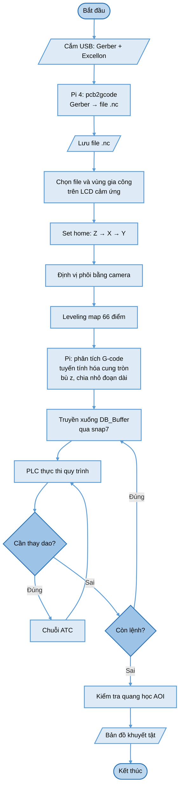
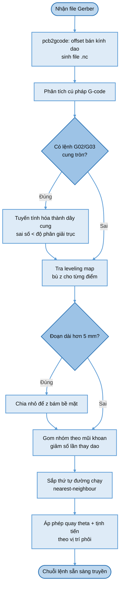
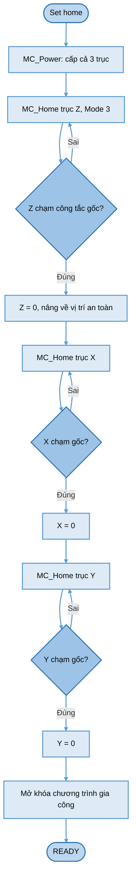
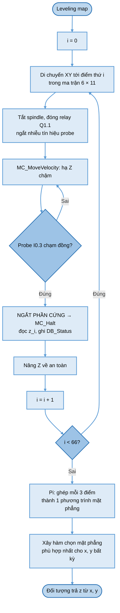
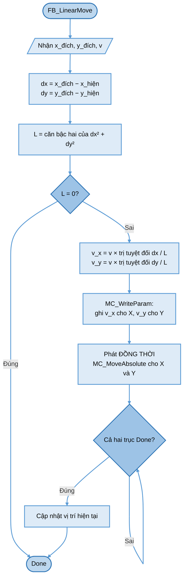
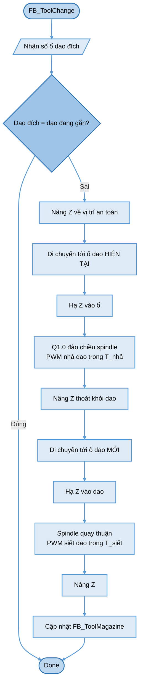
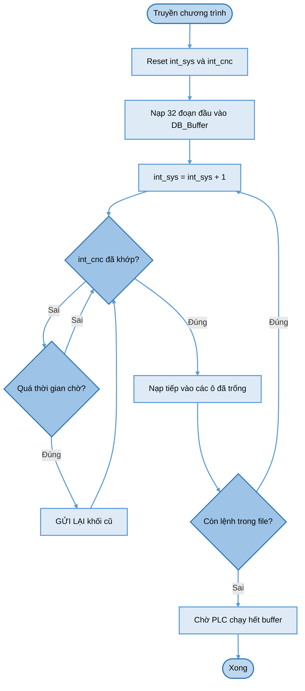
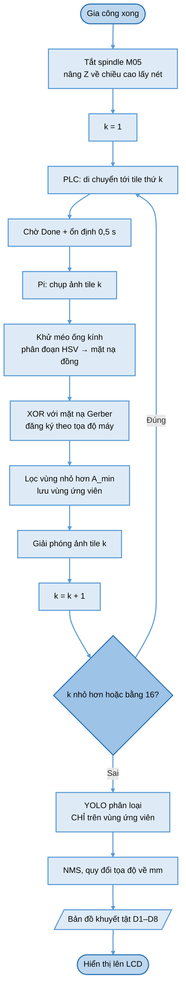
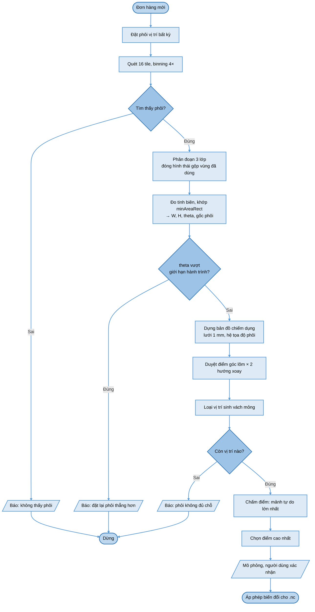
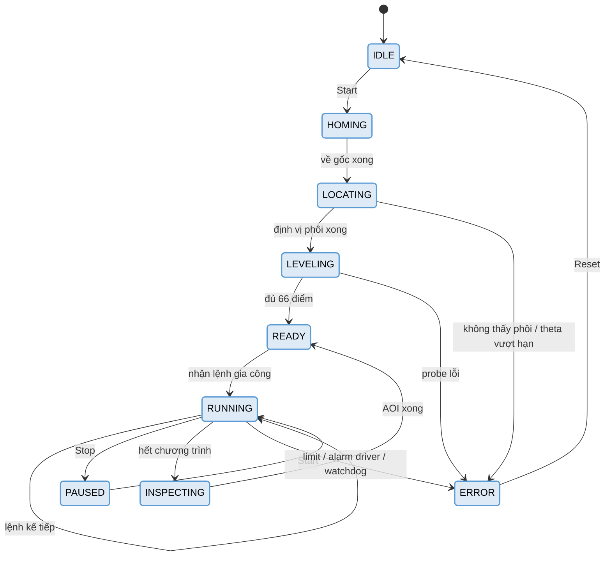

# Lưu đồ giải thuật toàn hệ thống

Tập hợp các lưu đồ của máy gia công mạch PCB tự động bản PLC S7-1200.
Chi tiết từng phần nằm ở các tài liệu chuyên đề được dẫn trong mỗi mục.

## Đối chiếu với đồ án gốc

Đồ án gốc có 8 lưu đồ. Bảng dưới cho thấy cái nào giữ, cái nào thay, cái nào thêm mới:

| Lưu đồ đồ án gốc | Bản này | Quan hệ |
|---|---|---|
| Hình 6.2 — Sơ đồ khối tổng quát | §1 | Vẽ lại theo luồng Gerber |
| Hình 6.5 + 6.6 — Xử lý ảnh, xử lý dữ liệu | §2 | **Thay** bằng biên dịch Gerber → `.nc` |
| Hình 6.12 — Kết xuất chương trình vận hành | §2 | Giữ, vẽ lại |
| Hình 6.17 — Set home | §3 | Giữ, đổi sang `MC_Home` Mode 3 |
| Hình 6.14 — Leveling map | §4 | **Giữ nguyên giải thuật** |
| Hình 6.18 + 6.19 — Chạy XY, BLU_mapping | §5 | **Thay** bằng nội suy vận tốc tỉ lệ |
| — | §6 | **Mới** — thay dao tự động |
| — | §7 | **Mới** — bắt tay truyền dữ liệu |
| — | §8 | **Mới** — kiểm tra quang học |
| — | §9 | **Mới** — định vị và tối ưu phôi |
| — | §10 | **Mới** — máy trạng thái hệ thống |

## Quy ước ký hiệu

Các lưu đồ dưới đây dùng bộ ký hiệu chuẩn:

| Ký hiệu | Hình dạng | Ý nghĩa |
|---|---|---|
| `([...])` | Bo tròn | Bắt đầu / Kết thúc |
| `[/.../]` | Bình hành | Nhập / Xuất dữ liệu |
| `[...]` | Chữ nhật | Xử lý |
| `{...}` | Thoi | Quyết định — hai nhánh **Đúng** / **Sai** |
| `(( ))` | Tròn nhỏ | Điểm nối các nhánh |

---

## 1. Vận hành tổng thể

## 2. Biên dịch Gerber → chương trình chạy máy

Thay hoàn toàn pipeline xử lý ảnh của đồ án gốc. Chi tiết: [`gerber-sang-nc.md`](gerber-sang-nc.md).

## 3. Set home

> **Thứ tự Z → X → Y không được đổi.** Z phải lên hết trước; nếu dao còn cắm trong phôi mà bàn máy
> chạy X/Y là gãy dao và xước bo.

## 4. Leveling map 66 điểm

Giữ nguyên giải thuật của đồ án gốc. Điểm khác duy nhất: dừng dao bằng **ngắt phần cứng**.

> Quét probe trong `OB1` thì sai số Z bằng cả một chu kỳ quét — với dao phay PCB ăn sâu vài chục µm
> thì đó là hỏng mạch. Ngắt phần cứng cho độ trễ cỡ µs.

## 5. Nội suy đường thẳng 2 trục

Thay Bresenham Line và BLU_mapping của đồ án gốc.
Chi tiết: [`chuc-nang-plc.md`](chuc-nang-plc.md) §4.2.

> Hai trục xuất phát cùng lúc, vận tốc tỉ lệ với quãng đường thành phần nên **về đích cùng lúc**
> → quỹ đạo là đường thẳng. Đây là cách duy nhất tạo đường thẳng trên các trục PTO độc lập.

## 6. Thay dao tự động

> `T_nhả` và `T_siết` **phải thực nghiệm lại ở 24 V**. Giá trị 200/200 ms và 250/250 ms của đồ án
> gốc đo ở 12 V nên không còn đúng.

## 7. Bắt tay truyền dữ liệu

Giữ triết lý *"truyền không nhanh, nhưng phải đủ"* của đồ án gốc, đổi từ đếm **từng lệnh** sang
đếm **theo ô ring buffer**.

> Độ trễ Ethernet 5–20 ms mỗi lượt khiến bắt tay từng lệnh chỉ đạt 50–200 lệnh/s — nghẽn với đường
> mạch nhiều đoạn ngắn. Ring buffer giải quyết việc này.

## 8. Kiểm tra quang học sau gia công

Chi tiết: [`kiem-tra-quang-hoc.md`](kiem-tra-quang-hoc.md).

> Bước **giải phóng ảnh ngay sau mỗi tile** là bắt buộc: 16 tile là 0,39 GB dữ liệu thô, giữ hết
> trong RAM là tràn.

## 9. Định vị phôi và tối ưu vị trí đặt

Chi tiết: [`dinh-vi-va-toi-uu-phoi.md`](dinh-vi-va-toi-uu-phoi.md).

## 10. Máy trạng thái hệ thống

---

## Tài liệu liên quan

| File | Nội dung |
|---|---|
| [`thiet-bi-va-chuc-nang.md`](thiet-bi-va-chuc-nang.md) | Danh sách thiết bị và chức năng tổng thể |
| [`chuc-nang-plc.md`](chuc-nang-plc.md) | Đặc tả PLC: I/O, khối hàm, sơ đồ nguyên lý |
| [`gerber-sang-nc.md`](gerber-sang-nc.md) | Sinh đường chạy dao từ file Gerber |
| [`kiem-tra-quang-hoc.md`](kiem-tra-quang-hoc.md) | Kiểm tra quang học tự động sau gia công |
| [`dinh-vi-va-toi-uu-phoi.md`](dinh-vi-va-toi-uu-phoi.md) | Định vị phôi và tối ưu tận dụng phôi thừa |
